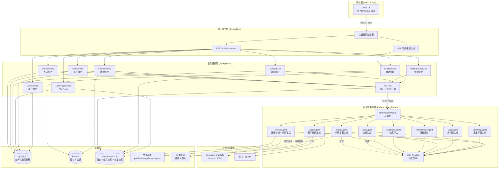
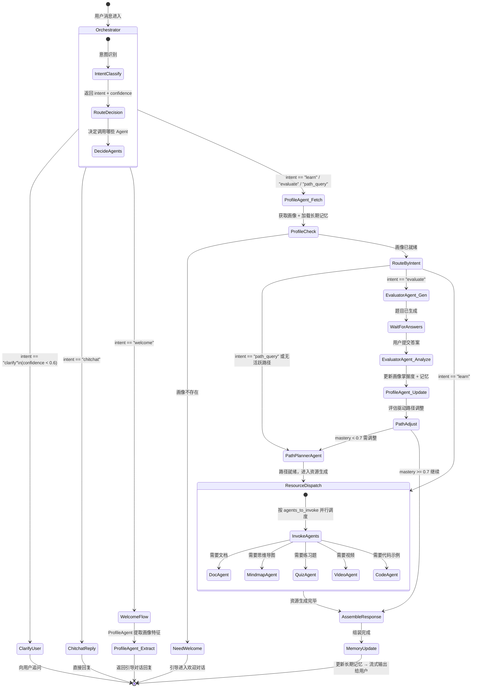
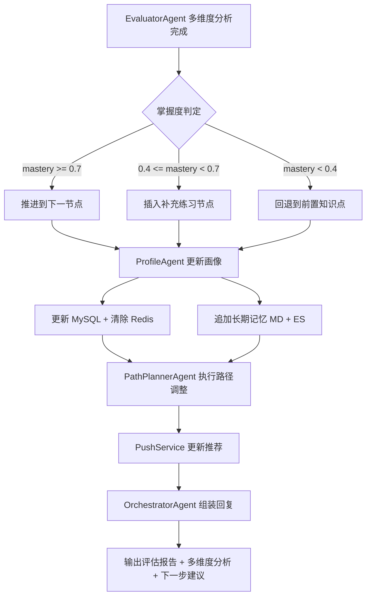
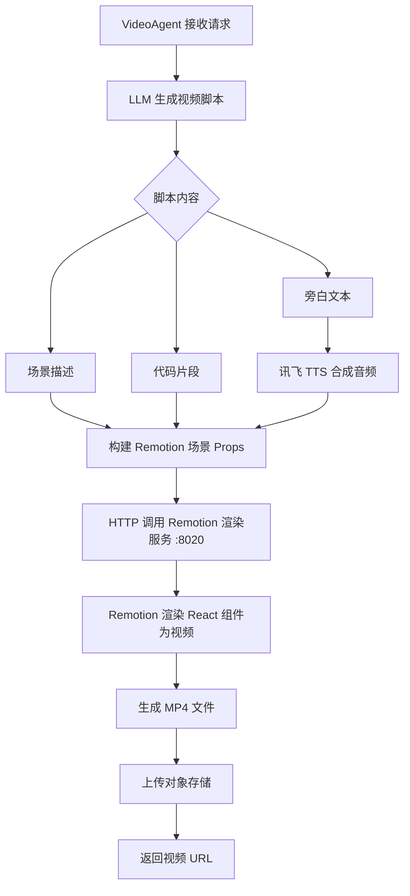
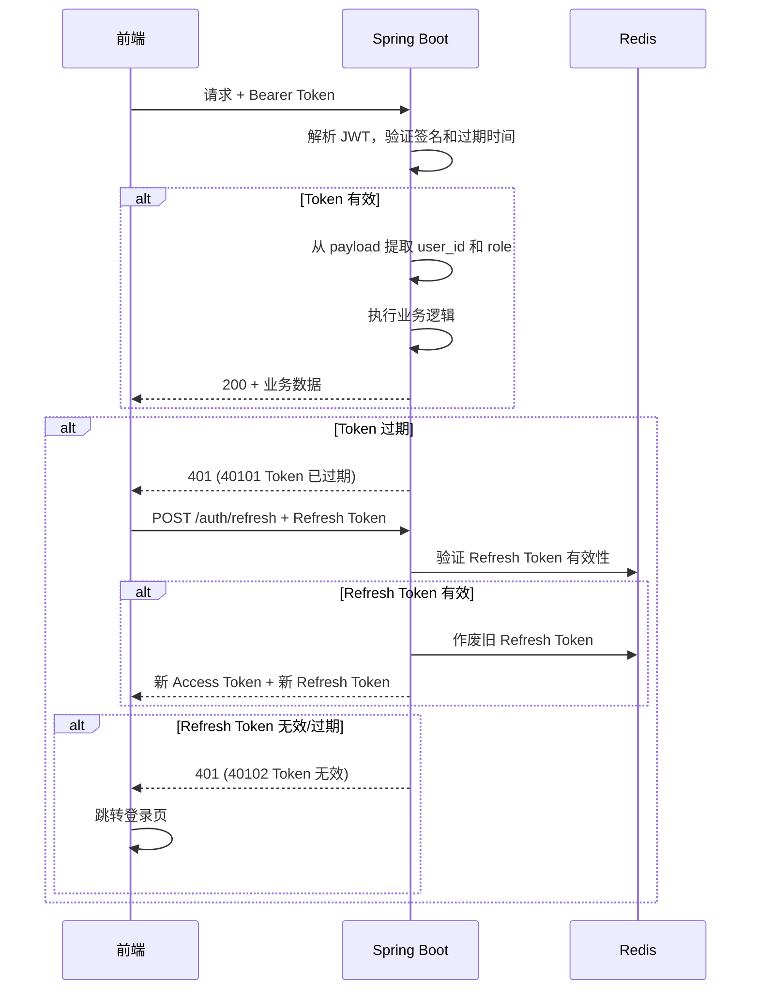
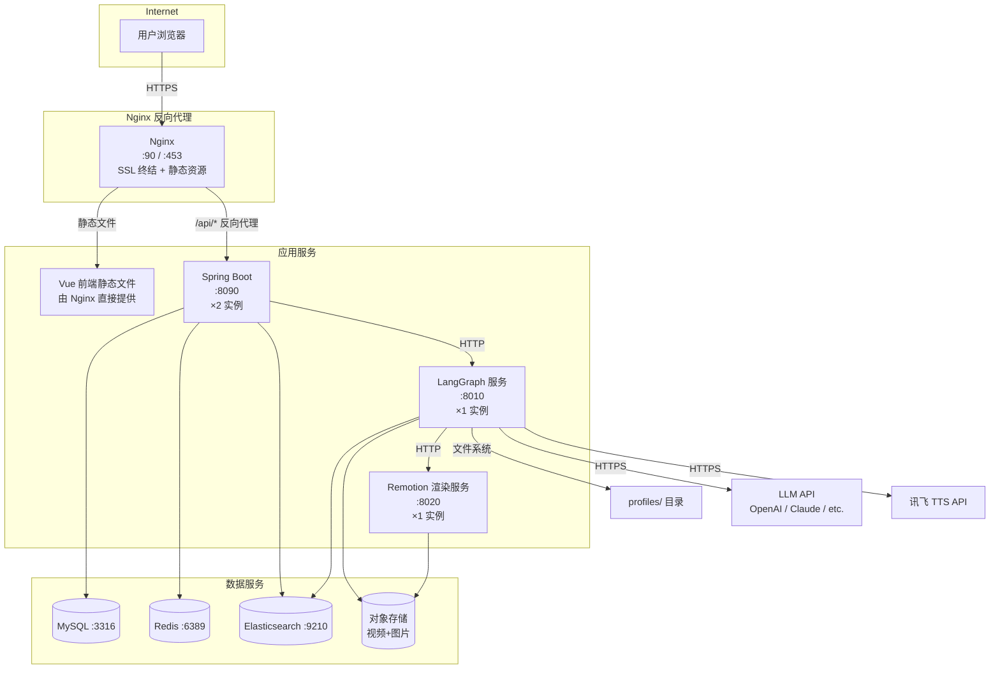

# 智伴（ZhiBan）技术设计文档（TDD）

> **文档版本**：v2.0  
> **创建日期**：2026-04-13  
> **作者**：架构团队  
> **状态**：Draft — 待评审  
> **关联文档**：[PRD v2.0](./PRD.md)

---

## 目录

1. [系统架构总览](#1-系统架构总览)
2. [模块设计](#2-模块设计)
3. [数据库设计](#3-数据库设计)
4. [接口规范](#4-接口规范)
5. [部署架构](#5-部署架构)
6. [非功能设计](#6-非功能设计)

---

## 1. 系统架构总览

### 1.1 整体架构图



### 1.2 各层职责说明

| 层级 | 技术栈 | 职责 |
|------|--------|------|
| **前端层** | Vue 3 + Vite + Pinia + Vue Router | 用户界面渲染、交互逻辑、SSE 流式消息接收、Mermaid 图表渲染、本地状态管理 |
| **API 网关层** | Spring Boot 3.x | 统一入口、JWT 认证鉴权、请求路由、限流、参数校验 |
| **业务逻辑层** | Spring Boot 3.x | 核心业务逻辑编排、数据持久化、推送服务、与 AI 层通信协调 |
| **AI 多智能体层** | Python 3.11+ / LangChain / LangGraph | 9 Agent 协作调度（含 5 个资源生成 Agent）、LLM 调用、个性化生成逻辑、长期记忆管理 |
| **Sidecar 服务** | Node.js + Remotion + 讯飞 TTS | 教学视频渲染、语音合成 |
| **数据层** | MySQL + Redis + ES + 文件系统 + 对象存储 | 结构化数据存储、缓存加速、向量检索、用户记忆 MD 文件、视频/图片存储 |

### 1.3 关键技术选型及理由

| 技术 | 选型 | 理由 |
|------|------|------|
| 前端框架 | Vue 3 + Composition API | 轻量灵活、学习曲线平缓，Composition API 利于复杂状态管理 |
| 构建工具 | Vite 5 | 开发热更新极快，生产构建基于 Rollup 体积小 |
| 状态管理 | Pinia | Vue 3 官方推荐，类型安全，轻量 |
| UI 组件库 | Element Plus | 中文生态成熟，组件丰富，适合后台管理类界面 |
| Markdown 渲染 | markdown-it + highlight.js + Mermaid.js | 支持代码高亮、数学公式（KaTeX）、Mermaid 图表渲染 |
| 思维导图渲染 | 前端自定义组件（基于 D3.js 或类似库） | 将 MindmapAgent 返回的 JSON 结构渲染为可交互思维导图 |
| 后端框架 | Spring Boot 3.x (Java 17+) | 企业级成熟框架，生态完善，天然支持 SSE 流式响应 |
| ORM | MyBatis-Plus | 灵活 SQL 控制能力强，自带分页 / 逻辑删除 / 自动填充 |
| AI 框架 | LangChain + LangGraph | LangGraph 原生支持有状态多 Agent 工作流，节点级重试与人工干预 |
| 视频渲染 | Remotion (React + Node.js) | 程序化视频生成框架，支持代码动画、文字覆盖、图表场景 |
| 语音合成 | 讯飞 TTS API | 中文语音质量高，支持多种音色，延迟低 |
| 关系数据库 | MySQL 8.0 | 成熟可靠，支撑用户、画像、评估、通知等结构化数据 |
| 缓存 | Redis 7 | 高性能 KV 存储，用于会话管理、画像缓存、限流计数 |
| 搜索与向量引擎 | Elasticsearch 8.x | 统一承担行为日志存储、全文检索（IK 中文分词）、向量检索（dense_vector + kNN），一套引擎覆盖三类需求 |
| Embedding 模型 | text-embedding-3-small (OpenAI) 或 bge-base-zh-v1.5 (本地) | 知识点和资源向量化，供语义检索使用 |
| 流式通信 | SSE (Server-Sent Events) | 单向服务端推流，比 WebSocket 轻量，足以满足 LLM 逐 token 输出场景 |
| 对象存储 | 阿里云 OSS / MinIO (本地开发) | 存储生成的视频、AI 图片等大文件 |
| AI 图片生成 | DALL-E / Stable Diffusion（可选） | 辅助生成教学图解，MVP 阶段可关闭 |

> **假设**：Embedding 模型 MVP 阶段使用 OpenAI text-embedding-3-small（1536 维，成本低），后续可切换到本地部署的 bge-base-zh-v1.5 以降低延迟和成本。待确认团队对本地模型部署的能力。

---

## 2. 模块设计

### 2.1 前端（Vue 3）

#### 2.1.1 页面/路由结构

```
/                           → 落地页（未登录重定向到 /login）
/login                      → 登录页
/register                   → 注册页（仅 email + password，简化注册）
/welcome                    → 引导式欢迎对话页（注册后自动跳转，通过对话建立初始画像）

/app                        → 主布局（需登录，侧边栏 + 顶栏）
/app/chat                   → 智能对话页（核心页面）
/app/path                   → 学习路径页
/app/path/:pathId           → 单条路径详情
/app/evaluate               → 评估中心（历史评估记录）
/app/evaluate/:evalId       → 单次评估详情
/app/dashboard              → 学习仪表盘（P1）
/app/profile                → 个人中心 + 画像查看/修改
/app/notifications          → 通知中心
/app/settings               → 系统设置

/teacher                    → 教师工作台布局（P1）
/teacher/resources          → 资源批量生成
/teacher/class              → 班级管理
/teacher/class/:classId     → 班级学情详情
```

#### 2.1.2 核心组件划分

```
src/
├── views/                      # 页面级组件
│   ├── chat/
│   │   └── ChatView.vue        # 对话主页
│   ├── path/
│   │   └── PathView.vue        # 学习路径
│   ├── evaluate/
│   │   └── EvalView.vue        # 评估中心
│   ├── auth/
│   │   ├── LoginView.vue
│   │   ├── RegisterView.vue    # 简化注册（仅 email + password）
│   │   └── WelcomeView.vue     # 引导式欢迎对话（建立初始画像）
│   ├── profile/
│   │   └── ProfileView.vue
│   └── notification/
│       └── NotificationView.vue # 通知中心页
├── components/                 # 可复用组件
│   ├── chat/
│   │   ├── ChatMessageList.vue    # 消息列表（含流式渲染）
│   │   ├── ChatInput.vue          # 输入框 + 发送按钮
│   │   ├── MessageBubble.vue      # 单条消息气泡
│   │   ├── ResourceCard.vue       # 嵌入式资源卡片
│   │   ├── VideoCard.vue          # 视频资源卡片（嵌入播放器）
│   │   └── CodeBlock.vue          # 代码示例块（含运行结果展示）
│   ├── path/
│   │   ├── PathTimeline.vue       # 路径时间线可视化
│   │   └── PathNodeCard.vue       # 路径节点卡片
│   ├── evaluate/
│   │   ├── QuizPanel.vue          # 答题面板
│   │   ├── QuizQuestion.vue       # 单题组件（支持选择/填空/代码题）
│   │   └── EvalReport.vue         # 评估报告（含多维度分析图表）
│   ├── resource/
│   │   ├── MindmapViewer.vue      # 思维导图渲染组件（JSON → 可交互图）
│   │   └── DocViewer.vue          # 文档查看器
│   ├── notification/
│   │   ├── NotificationBell.vue   # 顶栏通知铃铛（未读角标）
│   │   ├── NotificationList.vue   # 通知列表
│   │   └── RecommendCard.vue      # 今日推荐卡片（登录时展示）
│   ├── common/
│   │   ├── MarkdownRenderer.vue   # Markdown 渲染器（集成 Mermaid.js）
│   │   ├── MermaidDiagram.vue     # Mermaid 图表渲染组件
│   │   ├── LoadingStream.vue      # 流式加载动画
│   │   └── FeedbackButtons.vue    # 有用/没用反馈组件
│   └── layout/
│       ├── AppLayout.vue          # 主布局
│       ├── Sidebar.vue            # 侧边栏
│       └── TopNav.vue             # 顶部导航（含通知铃铛）
├── stores/                     # Pinia 状态管理
│   ├── useAuthStore.ts            # 认证状态
│   ├── useChatStore.ts            # 对话状态 + SSE 流管理
│   ├── usePathStore.ts            # 学习路径状态
│   ├── useProfileStore.ts         # 用户画像状态
│   └── useNotificationStore.ts    # 通知状态
├── api/                        # API 调用层
│   ├── http.ts                    # Axios 实例 + 拦截器
│   ├── auth.ts                    # 认证相关接口
│   ├── chat.ts                    # 对话相关接口
│   ├── path.ts                    # 路径相关接口
│   ├── evaluate.ts                # 评估相关接口
│   ├── profile.ts                 # 画像相关接口
│   └── notification.ts            # 通知相关接口
├── composables/                # 组合式函数
│   ├── useSSE.ts                  # SSE 流式连接管理
│   ├── useMarkdown.ts             # Markdown 渲染逻辑（含 Mermaid）
│   └── useMindmap.ts              # 思维导图数据解析与渲染
└── router/
    └── index.ts                   # 路由定义 + 导航守卫
```

#### 2.1.3 Mermaid 图表集成

前端 `MarkdownRenderer.vue` 集成 Mermaid.js，当 LLM 回复中包含 Mermaid 代码块时自动渲染为可视化图表。

```typescript
// composables/useMarkdown.ts
import MarkdownIt from 'markdown-it'
import mermaid from 'mermaid'

mermaid.initialize({ startOnLoad: false, theme: 'default' })

export function useMarkdown() {
  const md = new MarkdownIt({ html: false, linkify: true })

  // 自定义 fence 规则：检测 mermaid 代码块
  const defaultFence = md.renderer.rules.fence!
  md.renderer.rules.fence = (tokens, idx, options, env, self) => {
    const token = tokens[idx]
    if (token.info.trim() === 'mermaid') {
      const id = `mermaid-${idx}-${Date.now()}`
      return `<div class="mermaid-container" id="${id}">${token.content}</div>`
    }
    return defaultFence(tokens, idx, options, env, self)
  }

  // 渲染完成后初始化 Mermaid
  async function renderMermaidBlocks() {
    await mermaid.run({ querySelector: '.mermaid-container' })
  }

  return { md, renderMermaidBlocks }
}
```

#### 2.1.4 与后端的接口调用方式

**常规请求**：Axios HTTP 客户端，统一封装请求/响应拦截器。

```typescript
// api/http.ts
import axios from 'axios'

const http = axios.create({
  baseURL: import.meta.env.VITE_API_BASE_URL, // 例: http://localhost:8090/api/v1
  timeout: 15000
})

// 请求拦截：自动附加 JWT
http.interceptors.request.use(config => {
  const token = localStorage.getItem('access_token')
  if (token) config.headers.Authorization = `Bearer ${token}`
  return config
})

// 响应拦截：统一错误处理 + Token 刷新
http.interceptors.response.use(
  res => res.data,
  async error => {
    if (error.response?.status === 401) {
      // 尝试用 refresh_token 刷新
      // 刷新失败则跳转登录页
    }
    return Promise.reject(error)
  }
)
```

**流式请求**（对话场景）：使用浏览器原生 `fetch` + `ReadableStream` 接收 SSE。

```typescript
// composables/useSSE.ts
export function useSSE() {
  function streamChat(sessionId: string, message: string, onChunk: (text: string) => void) {
    const token = localStorage.getItem('access_token')
    
    fetch(`${import.meta.env.VITE_API_BASE_URL}/chat/stream`, {
      method: 'POST',
      headers: {
        'Content-Type': 'application/json',
        'Authorization': `Bearer ${token}`
      },
      body: JSON.stringify({ session_id: sessionId, message })
    }).then(async response => {
      const reader = response.body!.getReader()
      const decoder = new TextDecoder()
      
      while (true) {
        const { done, value } = await reader.read()
        if (done) break
        const chunk = decoder.decode(value, { stream: true })
        // 解析 SSE data: 行
        for (const line of chunk.split('\n')) {
          if (line.startsWith('data: ')) {
            const data = JSON.parse(line.slice(6))
            if (data.type === 'token') onChunk(data.content)
            if (data.type === 'done') return
          }
        }
      }
    })
  }

  return { streamChat }
}
```

### 2.2 后端（Spring Boot）

#### 2.2.1 包结构与分层设计

```
com.zhiban.server
├── config/                         # 配置类
│   ├── SecurityConfig.java            # Spring Security + JWT 配置
│   ├── CorsConfig.java               # 跨域配置
│   ├── RedisConfig.java              # Redis 序列化配置
│   ├── SchedulingConfig.java         # 定时任务配置
│   └── RestTemplateConfig.java       # AI 层 HTTP 客户端配置
├── common/                         # 公共模块
│   ├── result/
│   │   ├── ApiResult.java             # 统一响应封装
│   │   └── ErrorCode.java            # 错误码枚举
│   ├── exception/
│   │   ├── BizException.java          # 业务异常
│   │   └── GlobalExceptionHandler.java
│   └── util/
│       └── JwtUtil.java               # JWT 工具类
├── controller/                     # Controller 层（API 入口）
│   ├── AuthController.java           # 注册 / 登录 / Token 刷新
│   ├── ChatController.java           # 对话（含 SSE 流式）
│   ├── ProfileController.java        # 画像查询 / 修改
│   ├── PathController.java           # 学习路径
│   ├── EvalController.java           # 评估
│   ├── ResourceController.java       # 资源管理
│   └── NotificationController.java   # 通知管理
├── service/                        # Service 层（业务逻辑）
│   ├── AuthService.java
│   ├── ChatService.java
│   ├── ProfileService.java
│   ├── PathService.java
│   ├── EvalService.java
│   ├── ResourceService.java
│   ├── NotificationService.java      # 通知服务
│   ├── PushService.java              # 主动推送服务（定时任务）
│   └── AIClientService.java          # 封装对 AI 层的 HTTP 调用
├── model/                          # 数据模型
│   ├── entity/                       # 数据库实体
│   │   ├── User.java
│   │   ├── UserProfile.java
│   │   ├── LearningPath.java
│   │   ├── PathNode.java
│   │   ├── ChatSession.java
│   │   ├── ChatMessage.java
│   │   ├── Evaluation.java
│   │   ├── EvalQuestion.java
│   │   └── Notification.java         # 通知实体
│   ├── dto/                          # 请求/响应 DTO
│   │   ├── auth/
│   │   ├── chat/
│   │   ├── profile/
│   │   ├── path/
│   │   ├── eval/
│   │   └── notification/
│   └── vo/                           # 视图对象
├── mapper/                         # MyBatis-Plus Mapper
│   ├── UserMapper.java
│   ├── UserProfileMapper.java
│   ├── LearningPathMapper.java
│   ├── NotificationMapper.java
│   └── ...
├── scheduler/                      # 定时任务
│   ├── PushScheduler.java            # 主动推送定时任务
│   └── ProfileSnapshotScheduler.java # 画像快照
├── es/                             # Elasticsearch 操作
│   ├── LearningLogEsService.java      # 行为日志写入/查询
│   ├── ResourceCacheEsService.java    # 资源缓存写入/语义检索
│   ├── KnowledgeVectorEsService.java  # 知识点向量检索
│   └── UserMemoryEsService.java       # 用户长期记忆向量检索
└── ZhiBanApplication.java         # 启动类
```

#### 2.2.2 核心 API 接口清单

##### 认证模块

| 方法 | 路径 | 描述 |
|------|------|------|
| POST | `/api/v1/auth/register` | 用户注册（仅 email + password） |
| POST | `/api/v1/auth/login` | 用户登录 |
| POST | `/api/v1/auth/refresh` | 刷新 Token |
| POST | `/api/v1/auth/logout` | 注销登录 |

**POST /api/v1/auth/register**

请求（简化版，不含 survey）：
```json
{
  "email": "xiaoming@example.com",
  "password": "Abc123456!"
}
```

响应（成功）：
```json
{
  "code": 0,
  "message": "success",
  "data": {
    "user_id": "usr_a1b2c3d4",
    "access_token": "eyJhbGciOiJIUzI1NiIs...",
    "refresh_token": "eyJhbGciOiJIUzI1NiIs...",
    "expires_in": 7200,
    "is_new_user": true,
    "welcome_session_id": "sess_welcome_xyz"
  }
}
```

> 注：`is_new_user=true` 时前端跳转到 `/welcome` 页面，使用 `welcome_session_id` 发起引导式对话，ProfileAgent 从对话中提取画像特征。

**POST /api/v1/auth/login**

请求：
```json
{
  "email": "xiaoming@example.com",
  "password": "Abc123456!"
}
```

响应：
```json
{
  "code": 0,
  "message": "success",
  "data": {
    "user_id": "usr_a1b2c3d4",
    "nickname": "小明",
    "role": "STUDENT",
    "access_token": "eyJhbGciOiJIUzI1NiIs...",
    "refresh_token": "eyJhbGciOiJIUzI1NiIs...",
    "expires_in": 7200,
    "has_profile": true,
    "today_recommendation": {
      "knowledge_point": "binary_tree",
      "title": "二叉树遍历",
      "message": "今天继续学习二叉树吧！上次你在前序遍历上表现不错。"
    }
  }
}
```

> 注：`has_profile=false` 时前端跳转到 `/welcome` 继续引导对话。`today_recommendation` 为登录时推荐（由 PushService 调用 PathPlannerAgent 生成）。

##### 对话模块

| 方法 | 路径 | 描述 |
|------|------|------|
| POST | `/api/v1/chat/sessions` | 创建会话 |
| GET | `/api/v1/chat/sessions` | 获取会话列表 |
| GET | `/api/v1/chat/sessions/{sessionId}/messages` | 获取历史消息 |
| POST | `/api/v1/chat/stream` | 发送消息（SSE 流式返回） |

**POST /api/v1/chat/stream**

请求：
```json
{
  "session_id": "sess_x1y2z3",
  "message": "帮我讲讲快速排序的原理"
}
```

响应（SSE 流）：
```
data: {"type":"token","content":"快速"}

data: {"type":"token","content":"排序"}

data: {"type":"token","content":"（Quick Sort）是"}

data: {"type":"metadata","agent":"DocAgent","knowledge_point":"quick_sort"}

data: {"type":"resource_card","resource_type":"doc","title":"快速排序详解","difficulty":"INTERMEDIATE","est_minutes":15}

data: {"type":"resource_card","resource_type":"mindmap","title":"排序算法思维导图","data":{...}}

data: {"type":"resource_card","resource_type":"code","title":"快速排序 Python 实现","language":"python","code":"...","output":"..."}

data: {"type":"resource_card","resource_type":"video","title":"快速排序动画讲解","video_url":"https://oss.zhiban.com/videos/xxx.mp4","duration_seconds":180}

data: {"type":"mermaid","content":"graph TD\n  A[选取基准] --> B[分区]\n  B --> C[递归左半]\n  B --> D[递归右半]"}

data: {"type":"done","message_id":"msg_m1n2o3"}
```

##### 画像模块

| 方法 | 路径 | 描述 |
|------|------|------|
| GET | `/api/v1/profile` | 获取当前用户画像（7 维度） |
| PATCH | `/api/v1/profile` | 手动修改画像标签 |
| GET | `/api/v1/profile/history` | 获取画像变更历史 |

**GET /api/v1/profile**

响应：
```json
{
  "code": 0,
  "message": "success",
  "data": {
    "user_id": "usr_a1b2c3d4",
    "major": "计算机科学",
    "learning_goal": "EXAM_PREP",
    "preferred_style": "PRACTICE",
    "daily_time_minutes": 60,
    "study_frequency": "DAILY",
    "cognitive_style": "PRACTICAL",
    "knowledge_mastery": {
      "array": 0.85,
      "linked_list": 0.72,
      "stack": 0.68,
      "queue": 0.65,
      "binary_tree": 0.30,
      "sorting": 0.55,
      "graph": 0.10
    },
    "weak_points": ["binary_tree", "graph"],
    "error_patterns": [
      {"pattern": "递归终止条件遗漏", "frequency": 5, "related_kps": ["binary_tree", "recursion"]},
      {"pattern": "指针操作错误", "frequency": 3, "related_kps": ["linked_list"]}
    ],
    "style_weights": {
      "code_example": 0.6,
      "analogy": 0.25,
      "text": 0.15
    },
    "subjects": ["DATA_STRUCTURE", "ALGORITHM"],
    "updated_at": "2026-04-13T14:30:00Z"
  }
}
```

**PATCH /api/v1/profile**

请求：
```json
{
  "major": "软件工程",
  "cognitive_style": "THEORETICAL",
  "knowledge_mastery": {
    "linked_list": 0.90
  }
}
```

##### 学习路径模块

| 方法 | 路径 | 描述 |
|------|------|------|
| POST | `/api/v1/paths` | 创建学习路径 |
| GET | `/api/v1/paths` | 获取用户所有路径 |
| GET | `/api/v1/paths/{pathId}` | 获取路径详情（含节点树） |
| PATCH | `/api/v1/paths/{pathId}/nodes/{nodeId}` | 更新节点状态（跳过/完成） |

**POST /api/v1/paths**

请求：
```json
{
  "subject": "DATA_STRUCTURE",
  "goal": "掌握数据结构基础，能解决中等难度的 LeetCode 题目",
  "target_weeks": 8
}
```

响应：
```json
{
  "code": 0,
  "message": "success",
  "data": {
    "path_id": "path_p1q2r3",
    "subject": "DATA_STRUCTURE",
    "total_nodes": 18,
    "est_total_hours": 40,
    "nodes": [
      {
        "node_id": "node_001",
        "title": "数组基础",
        "knowledge_point": "array",
        "order": 1,
        "status": "PENDING",
        "est_minutes": 90,
        "prerequisites": [],
        "difficulty": "BEGINNER"
      },
      {
        "node_id": "node_002",
        "title": "链表原理与实现",
        "knowledge_point": "linked_list",
        "order": 2,
        "status": "PENDING",
        "est_minutes": 120,
        "prerequisites": ["node_001"],
        "difficulty": "BEGINNER"
      }
    ]
  }
}
```

##### 评估模块

| 方法 | 路径 | 描述 |
|------|------|------|
| POST | `/api/v1/evaluations` | 发起评估（指定知识点或路径阶段） |
| POST | `/api/v1/evaluations/{evalId}/submit` | 提交评估答案 |
| GET | `/api/v1/evaluations/{evalId}` | 获取评估结果（含多维度分析） |
| GET | `/api/v1/evaluations` | 获取评估历史 |

**POST /api/v1/evaluations**

请求：
```json
{
  "type": "MINI_QUIZ",
  "knowledge_point": "sorting",
  "path_node_id": "node_005"
}
```

响应：
```json
{
  "code": 0,
  "message": "success",
  "data": {
    "eval_id": "eval_e1f2g3",
    "type": "MINI_QUIZ",
    "knowledge_point": "sorting",
    "questions": [
      {
        "question_id": "q_001",
        "type": "SINGLE_CHOICE",
        "content": "快速排序的平均时间复杂度是？",
        "options": [
          {"key": "A", "value": "O(n)"},
          {"key": "B", "value": "O(n log n)"},
          {"key": "C", "value": "O(n²)"},
          {"key": "D", "value": "O(log n)"}
        ]
      },
      {
        "question_id": "q_002",
        "type": "FILL_BLANK",
        "content": "归并排序的空间复杂度为 ____"
      },
      {
        "question_id": "q_003",
        "type": "CODE",
        "content": "请实现快速排序的 partition 函数",
        "language": "python",
        "template": "def partition(arr, low, high):\n    # 请实现\n    pass"
      }
    ]
  }
}
```

**POST /api/v1/evaluations/{evalId}/submit**

请求：
```json
{
  "answers": [
    {"question_id": "q_001", "answer": "B"},
    {"question_id": "q_002", "answer": "O(n)"},
    {"question_id": "q_003", "answer": "def partition(arr, low, high):\n    pivot = arr[high]\n    i = low - 1\n    for j in range(low, high):\n        if arr[j] <= pivot:\n            i += 1\n            arr[i], arr[j] = arr[j], arr[i]\n    arr[i+1], arr[high] = arr[high], arr[i+1]\n    return i + 1"}
  ],
  "time_spent_seconds": 300
}
```

响应（多维度评估结果）：
```json
{
  "code": 0,
  "message": "success",
  "data": {
    "eval_id": "eval_e1f2g3",
    "score": 100,
    "total": 100,
    "assessment": {
      "knowledge_mastery": 0.85,
      "learning_efficiency": {
        "time_spent_seconds": 300,
        "accuracy": 1.0,
        "efficiency_score": 0.92,
        "comment": "答题速度快且准确率高，说明对排序知识掌握扎实"
      },
      "progress_trend": {
        "previous_mastery": 0.55,
        "current_mastery": 0.85,
        "improvement": 0.30,
        "trend": "IMPROVING",
        "comment": "相比上次评估提升了 30%，进步显著"
      },
      "weak_point_analysis": [
        {
          "pattern": "无明显薄弱点",
          "frequency": 0,
          "suggestion": "可以挑战更高难度的题目"
        }
      ]
    },
    "results": [
      {
        "question_id": "q_001",
        "correct": true,
        "correct_answer": "B",
        "explanation": "快速排序平均时间复杂度为 O(n log n)，最坏情况为 O(n²)。"
      },
      {
        "question_id": "q_002",
        "correct": true,
        "correct_answer": "O(n)",
        "explanation": "归并排序需要额外 O(n) 的空间用于合并操作。"
      },
      {
        "question_id": "q_003",
        "correct": true,
        "correct_answer": "...",
        "explanation": "partition 函数实现正确，使用了 Lomuto 分区方案。"
      }
    ],
    "recommendation": {
      "action": "ADVANCE",
      "message": "你对排序算法的掌握很好！建议继续学习下一个知识点：二叉树。",
      "next_node_id": "node_006"
    },
    "profile_updates": {
      "sorting": 0.85
    }
  }
}
```

##### 资源模块

| 方法 | 路径 | 描述 |
|------|------|------|
| POST | `/api/v1/resources/feedback` | 提交资源反馈 |
| GET | `/api/v1/resources/{resourceId}` | 获取已缓存资源 |
| GET | `/api/v1/resources/video/{videoId}` | 获取视频资源（返回播放 URL） |

**POST /api/v1/resources/feedback**

请求：
```json
{
  "resource_id": "res_r1s2t3",
  "resource_type": "doc",
  "message_id": "msg_m1n2o3",
  "feedback": "USEFUL",
  "comment": ""
}
```

##### 通知模块

| 方法 | 路径 | 描述 |
|------|------|------|
| GET | `/api/v1/notifications` | 获取通知列表（分页） |
| GET | `/api/v1/notifications/unread-count` | 获取未读通知数量 |
| PATCH | `/api/v1/notifications/{notificationId}/read` | 标记单条通知已读 |
| PATCH | `/api/v1/notifications/read-all` | 标记全部已读 |

**GET /api/v1/notifications**

响应：
```json
{
  "code": 0,
  "message": "success",
  "data": {
    "items": [
      {
        "notification_id": "notif_001",
        "type": "STUDY_REMINDER",
        "title": "该学习了",
        "content": "今天推荐学习：二叉树遍历。上次你在这个知识点的掌握度是 30%，继续加油！",
        "is_read": false,
        "created_at": "2026-04-13T09:00:00Z"
      },
      {
        "notification_id": "notif_002",
        "type": "INACTIVE_REMINDER",
        "title": "想你了",
        "content": "你已经 3 天没学习了，知识会遗忘的哦！来复习一下链表吧。",
        "is_read": true,
        "created_at": "2026-04-10T10:00:00Z"
      }
    ],
    "total": 15,
    "page": 1,
    "size": 20,
    "pages": 1
  }
}
```

#### 2.2.3 PushService 主动推送服务设计

```java
@Service
public class PushService {

    @Autowired private NotificationService notificationService;
    @Autowired private AIClientService aiClient;
    @Autowired private UserMapper userMapper;
    @Autowired private LearningPathMapper pathMapper;

    /**
     * 每日学习提醒 — 每天 09:00 执行
     * 根据用户偏好学习时间发送个性化提醒
     */
    @Scheduled(cron = "0 0 9 * * ?")
    public void dailyStudyReminder() {
        List<User> activeUsers = userMapper.selectActiveStudents();
        for (User user : activeUsers) {
            // 调用 PathPlannerAgent 获取当前推荐节点
            PathRecommendation rec = aiClient.callSync(
                "/ai/v1/path/recommend",
                Map.of("user_id", user.getUserId()),
                PathRecommendation.class
            );
            notificationService.create(Notification.builder()
                .userId(user.getUserId())
                .type("STUDY_REMINDER")
                .title("该学习了")
                .content("今天推荐学习：" + rec.getKnowledgePointTitle()
                    + "。" + rec.getEncouragement())
                .build());
        }
    }

    /**
     * 不活跃用户提醒 — 每天 10:00 检查
     * 3 天以上未登录的用户发送鼓励通知
     */
    @Scheduled(cron = "0 0 10 * * ?")
    public void inactiveUserReminder() {
        List<User> inactiveUsers = userMapper.selectInactiveUsers(3); // 3天未登录
        for (User user : inactiveUsers) {
            int daysInactive = calculateInactiveDays(user);
            notificationService.create(Notification.builder()
                .userId(user.getUserId())
                .type("INACTIVE_REMINDER")
                .title("想你了")
                .content("你已经 " + daysInactive + " 天没学习了，"
                    + "知识会遗忘的哦！来复习一下吧。")
                .build());
        }
    }

    /**
     * 登录时推荐 — 由 AuthService.login() 调用
     */
    public PathRecommendation getLoginRecommendation(String userId) {
        return aiClient.callSync(
            "/ai/v1/path/recommend",
            Map.of("user_id", userId),
            PathRecommendation.class
        );
    }
}
```

#### 2.2.4 与 AI 层的通信协议设计

Spring Boot 通过 HTTP 与 LangGraph 服务通信。AI 层暴露以下内部接口：

| 方法 | AI 层路径 | 描述 | 调用方式 |
|------|----------|------|---------|
| POST | `/ai/v1/chat` | 对话处理（流式） | SSE 流 |
| POST | `/ai/v1/chat/welcome` | 欢迎引导对话（流式，ProfileAgent 主导） | SSE 流 |
| POST | `/ai/v1/profile/analyze` | 画像分析/更新 | 同步 JSON |
| POST | `/ai/v1/profile/extract` | 从对话中提取画像特征 | 同步 JSON |
| POST | `/ai/v1/path/generate` | 生成学习路径 | 同步 JSON |
| POST | `/ai/v1/path/adjust` | 调整学习路径 | 同步 JSON |
| POST | `/ai/v1/path/recommend` | 获取当前推荐节点（用于推送） | 同步 JSON |
| POST | `/ai/v1/evaluate/generate` | 生成评估题目（QuizAgent） | 同步 JSON |
| POST | `/ai/v1/evaluate/analyze` | 分析评估结果（多维度） | 同步 JSON |
| POST | `/ai/v1/resource/doc` | 生成文档资源（DocAgent，流式） | SSE 流 |
| POST | `/ai/v1/resource/mindmap` | 生成思维导图（MindmapAgent） | 同步 JSON |
| POST | `/ai/v1/resource/quiz` | 生成练习题（QuizAgent） | 同步 JSON |
| POST | `/ai/v1/resource/video` | 生成教学视频（VideoAgent） | 异步 + 回调 |
| POST | `/ai/v1/resource/code` | 生成代码示例（CodeAgent） | 同步 JSON |

**通信协议约定**：

```java
// AIClientService.java 核心方法示例
@Service
public class AIClientService {

    @Value("${zhiban.ai.base-url}")
    private String aiBaseUrl;   // 例: http://localhost:8010

    private final RestTemplate restTemplate;
    private final WebClient webClient;  // 用于 SSE 流式

    /**
     * 同步调用 AI 层（画像、路径等非流式场景）
     */
    public <T> T callSync(String path, Object request, Class<T> responseType) {
        String url = aiBaseUrl + path;
        ResponseEntity<T> response = restTemplate.postForEntity(url, request, responseType);
        return response.getBody();
    }

    /**
     * 流式调用 AI 层（对话、资源生成）
     * 返回 Flux<String> 供 Controller 层通过 SSE 推送给前端
     */
    public Flux<String> callStream(String path, Object request) {
        return webClient.post()
            .uri(aiBaseUrl + path)
            .bodyValue(request)
            .retrieve()
            .bodyToFlux(String.class);
    }

    /**
     * 异步调用 AI 层（视频生成等耗时任务）
     * 提交任务后立即返回 task_id，视频生成完成后通过回调通知
     */
    public String callAsync(String path, Object request) {
        String url = aiBaseUrl + path;
        Map<String, String> response = restTemplate.postForObject(url, request, Map.class);
        return response.get("task_id");
    }
}
```

**AI 层统一请求格式**：

```json
{
  "user_id": "usr_a1b2c3d4",
  "session_id": "sess_x1y2z3",
  "profile": { /* 用户画像 JSON（7 维度），由 Spring Boot 从缓存/DB 获取后传入 */ },
  "memory_context": { /* 可选：从 ES zhiban-user-memory 检索的相关记忆片段 */ },
  "payload": { /* 具体业务数据，因接口而异 */ },
  "config": {
    "model": "gpt-4o",
    "temperature": 0.7,
    "max_tokens": 4096,
    "stream": true
  }
}
```

**AI 层统一响应格式（同步）**：

```json
{
  "status": "success",
  "agent": "DocAgent",
  "data": { /* 具体返回数据 */ },
  "memory_updates": [
    {"category": "preference", "content": "用户偏好通过代码示例学习排序算法"}
  ],
  "metadata": {
    "model_used": "gpt-4o",
    "tokens_used": 1523,
    "latency_ms": 2340,
    "agents_invoked": ["DocAgent", "CodeAgent"]
  }
}
```

### 2.3 AI 多智能体层（LangGraph）

#### 2.3.1 StateGraph 状态定义

```python
from typing import TypedDict, Literal, Optional
from langgraph.graph import StateGraph

class ZhiBanState(TypedDict):
    """LangGraph 全局状态定义"""
    
    # ---- 请求上下文 ----
    user_id: str
    session_id: str
    user_message: str                           # 用户原始输入
    
    # ---- 意图识别 ----
    intent: Literal[
        "learn", "path_query", "evaluate",
        "profile_update", "progress_query", "chitchat",
        "clarify",                              # 需要追问
        "welcome"                               # 欢迎引导对话
    ]
    intent_confidence: float                    # 0.0 ~ 1.0
    matched_knowledge_points: list[dict]        # ES kNN 检索命中的知识点 [{"id":"quick_sort","score":0.92}]
    
    # ---- 用户画像 ----
    profile: dict                               # 用户画像 JSON（7 维度）
    profile_updated: bool                       # 本轮是否更新了画像
    memory_context: list[dict]                  # 从长期记忆检索的相关片段
    
    # ---- 学习路径 ----
    current_path: Optional[dict]                # 当前活跃路径
    current_node: Optional[dict]                # 当前学习节点
    path_adjustment: Optional[dict]             # 路径调整指令
    
    # ---- 资源生成（5 个 Agent 各自的输出） ----
    generated_doc: Optional[str]                # DocAgent: 文档内容（Markdown）
    generated_mindmap: Optional[dict]           # MindmapAgent: 思维导图 JSON 结构
    generated_quiz: Optional[list]              # QuizAgent: 练习题列表
    generated_video_url: Optional[str]          # VideoAgent: 视频 URL（异步生成）
    generated_code: Optional[dict]              # CodeAgent: 代码示例 {"code","language","output","explanation"}
    resource_metadata: Optional[dict]           # 资源元数据
    
    # ---- 评估 ----
    eval_questions: Optional[list]              # 生成的评估题目
    eval_answers: Optional[list]                # 用户提交的答案
    eval_result: Optional[dict]                 # 评估结果分析（含多维度）
    
    # ---- 输出 ----
    response_chunks: list[str]                  # 流式输出 chunks
    final_response: str                         # 最终完整回复
    
    # ---- 控制 ----
    agents_to_invoke: list[str]                 # OrchestratorAgent 决定要调用的 Agent 列表
    error: Optional[str]                        # 错误信息
    retry_count: int                            # 当前重试次数
```

#### 2.3.2 各 Agent 的输入、输出、职责边界

| Agent | 职责 | 输入（从 State 读取） | 输出（写入 State） | LLM 调用 |
|-------|------|----------------------|-------------------|----------|
| **OrchestratorAgent** | 意图识别、任务分解、路由调度（决定调用哪些 Agent）、闲聊回复、结果组装。对 `learn` 意图，将用户消息向量化后从 ES `zhiban-knowledge-vectors` 索引中检索最匹配的知识点 | `user_message`, `session_id` | `intent`, `intent_confidence`, `matched_knowledge_points`, `agents_to_invoke`, `final_response` | 是（意图分类 + 闲聊生成）+ ES kNN 检索 |
| **ProfileAgent** | 画像查询、初始化（从引导对话中提取特征）、基于行为/评估数据更新画像。管理长期记忆（读 MD 文件 + ES 向量记忆，写新观察） | `user_id`, `eval_result`, `user_message`, `memory_context` | `profile`, `profile_updated`, `memory_context` | 是（分析学习风格偏好、提取对话特征） |
| **DocAgent** | 根据画像和知识点生成个性化结构化课程文档（Markdown）。根据认知风格调整语言、示例、深度。可选调用 DALL-E 生成辅助图解 | `profile`, `current_node`, `user_message`, `memory_context` | `generated_doc`, `resource_metadata` | 是（核心生成逻辑）+ ES 语义检索（RAG）|
| **MindmapAgent** | 生成知识点思维导图。输出结构化 JSON 供前端渲染，不生成图片 | `profile`, `current_node`, `matched_knowledge_points` | `generated_mindmap`, `resource_metadata` | 是（思维导图结构生成） |
| **QuizAgent** | 生成练习题（单选 / 填空 / 代码题）。根据画像掌握度调整难度。查 ES `zhiban-eval-questions` 去重 | `profile`, `current_node`, `user_message` | `generated_quiz`, `resource_metadata` | 是（题目生成）+ ES 去重检索 |
| **VideoAgent** | 生成教学视频。LLM 生成脚本 → 讯飞 TTS 合成音频 → Remotion 渲染视频 → 上传对象存储 | `profile`, `current_node`, `user_message` | `generated_video_url`, `resource_metadata` | 是（脚本生成）+ 讯飞 TTS + Remotion HTTP |
| **CodeAgent** | 生成可执行代码示例（Python / Java / C++）。包含代码 + 行内注释 + 预期输出 + 分步讲解。可选调用 DALL-E 生成流程图 | `profile`, `current_node`, `user_message` | `generated_code`, `resource_metadata` | 是（代码生成 + 讲解） |
| **PathPlannerAgent** | 生成学习路径、根据评估结果调整路径、提供登录推荐 | `profile`, `eval_result`, 知识图谱（外部加载） | `current_path`, `current_node`, `path_adjustment` | 是（路径优化推理） |
| **EvaluatorAgent** | 生成评估题目、分析答案、输出多维度评估报告（知识掌握度 + 学习效率 + 进步趋势 + 弱点分析）。生成前从 ES `zhiban-eval-questions` 中检索相似题目去重 | `profile`, `current_node`, `eval_answers` | `eval_questions`, `eval_result` | 是（题目生成 + 错误分析）+ ES 去重检索 |

#### 2.3.3 ProfileAgent 长期记忆系统设计

**双存储架构**：

```
┌─────────────────────────────────────────────────────┐
│  MD 文件: profiles/{user_id}/memory.md               │
│  位置: AI 服务文件系统                                 │
│  内容: 结构化摘要（用户特质、偏好、关键历史事件）         │
│  Agent 每次对话开始时读取，对话结束后追加新观察           │
│  格式: YAML front matter + Markdown sections          │
└──────────────────┬──────────────────────────────────┘
                   │
                   ▼  互补
┌─────────────────────────────────────────────────────┐
│  ES 索引: zhiban-user-memory                         │
│  内容: 向量嵌入的记忆片段，支持语义检索                  │
│  每条记录: user_id, content, embedding, category,     │
│           timestamp                                   │
│  category: trait / preference / history               │
│  用途: 语义检索相关记忆（"用户上次学排序时说了什么"）     │
└─────────────────────────────────────────────────────┘
```

**Memory MD 文件格式示例**：

```markdown
---
user_id: usr_a1b2c3d4
last_updated: 2026-04-13T14:30:00Z
---

## 用户特质
- 计算机科学专业大三学生
- 偏好通过代码示例理解算法，不喜欢纯理论叙述
- 对递归概念理解较慢，需要更多图示辅助

## 学习偏好
- 喜欢先看完整代码再逐行讲解
- 倾向 Python 作为示例语言
- 每次学习时长约 45 分钟，超过后注意力下降

## 关键历史
- [2026-04-10] 首次学习二叉树，反映前序遍历递归过程不直观
- [2026-04-12] 排序算法评估得分 85%，快速排序 partition 理解到位
- [2026-04-13] 主动要求练习链表题目，说明学习积极性高

## 易错点
- 递归终止条件经常遗漏（出现 3 次）
- 链表指针操作顺序错误（出现 2 次）
```

**ProfileAgent 记忆读写流程**：

```python
class ProfileAgent:
    async def load_memory(self, user_id: str) -> dict:
        """对话开始时加载用户记忆"""
        # 1. 读取 MD 文件（结构化摘要）
        md_path = f"profiles/{user_id}/memory.md"
        md_content = read_file(md_path) if file_exists(md_path) else ""
        
        # 2. 从 ES 检索语义相关记忆片段
        relevant_memories = es_client.knn_search(
            index="zhiban-user-memory",
            query_vector=embed(user_message),
            filter={"term": {"user_id": user_id}},
            k=5
        )
        
        return {
            "structured_summary": md_content,
            "relevant_memories": relevant_memories
        }
    
    async def update_memory(self, user_id: str, conversation: list, observations: list):
        """对话结束后更新记忆"""
        # 1. 用 LLM 从对话中提取新观察
        new_observations = await self.extract_observations(conversation)
        
        # 2. 追加到 MD 文件
        md_path = f"profiles/{user_id}/memory.md"
        append_to_file(md_path, format_observations(new_observations))
        
        # 3. 向量化后写入 ES
        for obs in new_observations:
            es_client.index(
                index="zhiban-user-memory",
                document={
                    "user_id": user_id,
                    "content": obs["content"],
                    "embedding": embed(obs["content"]),
                    "category": obs["category"],  # trait / preference / history
                    "timestamp": datetime.utcnow()
                }
            )
```

**双通道画像更新机制**：

| 通道 | 触发时机 | 数据来源 | 更新目标 | 说明 |
|------|---------|---------|---------|------|
| **通道 A：对话驱动** | 每次对话结束后 | ProfileAgent 从对话中提取新特征/观察 | MD 文件（追加）+ ES zhiban-user-memory（索引）| 捕获用户偏好、认知风格、学习习惯等软特征 |
| **通道 B：行为驱动** | 评估完成 / 资源反馈 / 学习行为 | 评估分数、正确率、耗时、反馈等结构化数据 | MySQL user_profile（更新 JSON 字段）+ 清除 Redis 缓存 | 更新掌握度、易错点等硬指标 |

#### 2.3.4 Agent 间的状态流转图

**主对话流程**：



**评估后自适应调整流程**：



**VideoAgent 视频生成流程**：



#### 2.3.5 LangGraph 工作流构建代码

```python
from langgraph.graph import StateGraph, END

def build_chat_graph() -> StateGraph:
    graph = StateGraph(ZhiBanState)

    # 添加节点 — 9 个 Agent
    graph.add_node("orchestrator", orchestrator_node)
    graph.add_node("profile_fetch", profile_fetch_node)        # ProfileAgent: 加载画像 + 记忆
    graph.add_node("profile_update", profile_update_node)      # ProfileAgent: 更新画像 + 记忆
    graph.add_node("profile_extract", profile_extract_node)    # ProfileAgent: 从对话提取特征
    graph.add_node("path_planner", path_planner_node)          # PathPlannerAgent
    graph.add_node("doc_gen", doc_gen_node)                    # DocAgent
    graph.add_node("mindmap_gen", mindmap_gen_node)            # MindmapAgent
    graph.add_node("quiz_gen", quiz_gen_node)                  # QuizAgent
    graph.add_node("video_gen", video_gen_node)                # VideoAgent
    graph.add_node("code_gen", code_gen_node)                  # CodeAgent
    graph.add_node("evaluator_gen", evaluator_gen_node)        # EvaluatorAgent: 生成题目
    graph.add_node("evaluator_analyze", evaluator_analyze_node)# EvaluatorAgent: 分析答案
    graph.add_node("resource_dispatch", resource_dispatch_node)# 资源调度（并行调用多个 Agent）
    graph.add_node("assemble", assemble_response_node)
    graph.add_node("memory_update", memory_update_node)        # 对话结束更新记忆

    # 入口
    graph.set_entry_point("orchestrator")

    # 条件边：意图路由
    graph.add_conditional_edges("orchestrator", route_by_intent, {
        "chitchat": "assemble",
        "clarify": "assemble",
        "welcome": "profile_extract",       # 欢迎对话 → 提取画像
        "learn": "profile_fetch",
        "path_query": "profile_fetch",
        "evaluate": "profile_fetch",
        "profile_update": "profile_update",
        "progress_query": "assemble",
    })

    # 欢迎对话画像提取 → 组装
    graph.add_edge("profile_extract", "assemble")

    # 画像获取后路由
    graph.add_conditional_edges("profile_fetch", route_after_profile, {
        "need_welcome": "assemble",          # 画像不存在，引导进入欢迎
        "learn": "resource_dispatch",        # 学习请求 → 资源调度
        "path_query": "path_planner",
        "evaluate": "evaluator_gen",
    })

    # 资源调度节点 — 根据 agents_to_invoke 并行调用多个资源 Agent
    graph.add_conditional_edges("resource_dispatch", route_resource_agents, {
        "doc": "doc_gen",
        "mindmap": "mindmap_gen",
        "quiz": "quiz_gen",
        "video": "video_gen",
        "code": "code_gen",
        "assemble": "assemble",              # 无需额外资源生成
    })

    # 各资源 Agent 完成后 → 组装
    graph.add_edge("doc_gen", "assemble")
    graph.add_edge("mindmap_gen", "assemble")
    graph.add_edge("quiz_gen", "assemble")
    graph.add_edge("video_gen", "assemble")
    graph.add_edge("code_gen", "assemble")

    # 路径规划完成后 → 资源调度
    graph.add_edge("path_planner", "resource_dispatch")

    # 评估题目生成 → 组装（返回题目给用户）
    graph.add_edge("evaluator_gen", "assemble")

    # 评估分析完成 → 更新画像
    graph.add_edge("evaluator_analyze", "profile_update")

    # 画像更新 → 条件判断是否调整路径
    graph.add_conditional_edges("profile_update", route_after_eval, {
        "adjust_path": "path_planner",
        "done": "assemble",
    })

    # 组装完成 → 更新长期记忆 → 结束
    graph.add_edge("assemble", "memory_update")
    graph.add_edge("memory_update", END)

    return graph.compile()


def resource_dispatch_node(state: ZhiBanState) -> dict:
    """
    资源调度节点：根据 OrchestratorAgent 决定的 agents_to_invoke，
    并行调用多个资源生成 Agent。
    """
    agents = state.get("agents_to_invoke", ["doc"])
    # LangGraph 支持 fan-out / fan-in 模式
    # 此节点设置标志，由条件边路由到各资源 Agent
    return {"agents_to_invoke": agents}


def route_resource_agents(state: ZhiBanState) -> list[str]:
    """
    根据 agents_to_invoke 返回需要并行调用的 Agent 节点名。
    LangGraph 支持返回多个目标节点实现并行执行。
    """
    agents = state.get("agents_to_invoke", [])
    mapping = {
        "doc": "doc_gen",
        "mindmap": "mindmap_gen",
        "quiz": "quiz_gen",
        "video": "video_gen",
        "code": "code_gen",
    }
    targets = [mapping[a] for a in agents if a in mapping]
    return targets if targets else ["assemble"]
```

#### 2.3.6 VideoAgent 与 Remotion Sidecar 服务交互设计

```python
# agents/video_gen.py

import httpx
from xunfei_tts import XunfeiTTSClient

class VideoAgent:
    def __init__(self):
        self.remotion_url = "http://localhost:8020"
        self.tts_client = XunfeiTTSClient()
        self.oss_client = OSSClient()
    
    async def generate_video(self, state: ZhiBanState) -> dict:
        profile = state["profile"]
        knowledge_point = state["current_node"]["knowledge_point"]
        
        # Step 1: LLM 生成视频脚本
        script = await self.generate_script(knowledge_point, profile)
        # script 结构: {
        #   "title": "快速排序详解",
        #   "scenes": [
        #     {"type": "title", "text": "快速排序", "narration": "今天我们来学习快速排序算法"},
        #     {"type": "code", "language": "python", "code": "def quick_sort(...):", 
        #      "narration": "首先看一下快速排序的实现代码", "highlight_lines": [3,4,5]},
        #     {"type": "diagram", "mermaid": "graph TD...", "narration": "整体流程如图所示"},
        #   ],
        #   "total_duration_estimate": 180
        # }
        
        # Step 2: 讯飞 TTS 合成每个场景的音频
        audio_urls = []
        for scene in script["scenes"]:
            audio_data = await self.tts_client.synthesize(
                text=scene["narration"],
                voice="xiaoyan",  # 讯飞语音类型
                speed=5,
                format="mp3"
            )
            audio_url = await self.oss_client.upload(audio_data, f"tts/{uuid4()}.mp3")
            audio_urls.append(audio_url)
        
        # Step 3: 调用 Remotion 渲染服务
        render_request = {
            "composition": "TeachingVideo",
            "props": {
                "title": script["title"],
                "scenes": script["scenes"],
                "audio_urls": audio_urls,
            },
            "output_format": "mp4",
            "fps": 30,
            "width": 1920,
            "height": 1080,
        }
        
        async with httpx.AsyncClient(timeout=300) as client:
            resp = await client.post(
                f"{self.remotion_url}/render",
                json=render_request
            )
            result = resp.json()
            video_path = result["output_path"]
        
        # Step 4: 上传到对象存储
        video_url = await self.oss_client.upload_file(video_path)
        
        return {
            "generated_video_url": video_url,
            "resource_metadata": {
                "type": "video",
                "title": script["title"],
                "duration_seconds": script["total_duration_estimate"],
                "knowledge_point": knowledge_point,
            }
        }
```

**Remotion 渲染服务（Node.js sidecar）**：

```typescript
// remotion-service/server.ts (Express + Remotion)
import express from 'express';
import { bundle } from '@remotion/bundler';
import { renderMedia, selectComposition } from '@remotion/renderer';

const app = express();
app.use(express.json());

app.post('/render', async (req, res) => {
  const { composition, props, output_format, fps, width, height } = req.body;
  
  try {
    const bundleLocation = await bundle(require.resolve('./src/index'));
    const comp = await selectComposition({
      serveUrl: bundleLocation,
      id: composition,
      inputProps: props,
    });
    
    const outputPath = `/tmp/renders/${Date.now()}.${output_format}`;
    await renderMedia({
      composition: comp,
      serveUrl: bundleLocation,
      codec: output_format === 'mp4' ? 'h264' : 'vp8',
      outputLocation: outputPath,
      inputProps: props,
    });
    
    res.json({ status: 'success', output_path: outputPath });
  } catch (error) {
    res.status(500).json({ status: 'error', message: error.message });
  }
});

app.listen(8020, () => console.log('Remotion renderer on :8020'));
```

#### 2.3.7 异常处理与重试机制

```python
import asyncio
from langchain_core.runnables import RunnableConfig

# 节点级重试装饰器
def with_retry(max_retries: int = 1, timeout_seconds: int = 15):
    def decorator(func):
        async def wrapper(state: ZhiBanState, config: RunnableConfig) -> dict:
            for attempt in range(max_retries + 1):
                try:
                    return await asyncio.wait_for(
                        func(state, config),
                        timeout=timeout_seconds
                    )
                except asyncio.TimeoutError:
                    if attempt < max_retries:
                        continue  # 重试
                    return {
                        "error": f"Agent {func.__name__} 超时（已重试 {max_retries} 次）",
                        "final_response": "抱歉，我思考得有点久了，请稍后再试。"
                    }
                except Exception as e:
                    return {
                        "error": f"Agent {func.__name__} 异常: {str(e)}",
                        "final_response": "系统暂时开小差了，请稍后再试。"
                    }
        return wrapper
    return decorator

# 使用示例
@with_retry(max_retries=1, timeout_seconds=15)
async def doc_gen_node(state: ZhiBanState, config: RunnableConfig) -> dict:
    """DocAgent 节点实现"""
    # ... 调用 LLM 生成文档 ...
    pass

# VideoAgent 特殊处理：超时时间更长（视频渲染耗时）
@with_retry(max_retries=1, timeout_seconds=300)
async def video_gen_node(state: ZhiBanState, config: RunnableConfig) -> dict:
    """VideoAgent 节点实现 — 视频生成耗时较长"""
    # ... 调用 LLM + TTS + Remotion ...
    pass
```

**异常处理策略汇总**：

| 异常类型 | 处理方式 | 降级策略 |
|---------|---------|---------|
| LLM API 超时（>15s） | 自动重试 1 次 | 返回缓存资源（如有），否则友好提示 |
| LLM API 限流（429） | 指数退避重试（1s → 2s → 4s），最多 3 次 | 提示用户稍后再试 |
| LLM 返回格式异常 | 尝试 JSON 修复解析，失败则重新请求（调低 temperature） | 返回原始文本 |
| Agent 内部异常 | 捕获异常，写入 State.error | OrchestratorAgent 检测 error 后返回兜底回复 |
| VideoAgent 渲染失败 | Remotion 服务不可用时跳过视频生成 | 返回文档 + 代码替代，提示"视频生成中，稍后可查看" |
| 讯飞 TTS 失败 | 重试 1 次 | 生成无音频的静默视频，或降级为纯文本脚本 |
| 记忆文件读写失败 | 捕获 IO 异常 | 跳过记忆加载，使用纯 MySQL 画像数据 |
| 知识图谱缺失 | PathPlannerAgent 检测到目标科目无图谱 | 返回"该科目正在建设中" |
| 内容安全拦截 | OrchestratorAgent 预处理阶段过滤 | 提示用户调整输入 |

---

## 3. 数据库设计

### 3.1 核心数据表结构

#### MySQL 表

##### `user` — 用户表

```sql
CREATE TABLE `user` (
    `id`            BIGINT          NOT NULL AUTO_INCREMENT  COMMENT '主键',
    `user_id`       VARCHAR(32)     NOT NULL                 COMMENT '业务用户ID (usr_xxxx)',
    `nickname`      VARCHAR(64)     NULL                     COMMENT '昵称（可由引导对话中获取）',
    `email`         VARCHAR(128)    NOT NULL                 COMMENT '邮箱',
    `password_hash` VARCHAR(255)    NOT NULL                 COMMENT 'BCrypt密码哈希',
    `role`          VARCHAR(16)     NOT NULL DEFAULT 'STUDENT' COMMENT '角色: STUDENT / TEACHER',
    `status`        TINYINT         NOT NULL DEFAULT 1       COMMENT '状态: 1-正常 0-禁用 -1-注销',
    `last_login_at` DATETIME        NULL                     COMMENT '最后登录时间（用于不活跃检测）',
    `created_at`    DATETIME        NOT NULL DEFAULT CURRENT_TIMESTAMP,
    `updated_at`    DATETIME        NOT NULL DEFAULT CURRENT_TIMESTAMP ON UPDATE CURRENT_TIMESTAMP,
    PRIMARY KEY (`id`),
    UNIQUE KEY `uk_user_id` (`user_id`),
    UNIQUE KEY `uk_email` (`email`),
    KEY `idx_last_login` (`last_login_at`)
) ENGINE=InnoDB DEFAULT CHARSET=utf8mb4 COMMENT='用户表';
```

##### `user_profile` — 用户画像表（7 维度）

```sql
CREATE TABLE `user_profile` (
    `id`                BIGINT          NOT NULL AUTO_INCREMENT,
    `user_id`           VARCHAR(32)     NOT NULL                 COMMENT '用户ID',
    -- 维度 1: 专业背景
    `major`             VARCHAR(64)     NULL                     COMMENT '专业/领域',
    -- 维度 2: 知识基础（per 知识点掌握度）
    `knowledge_mastery` JSON            NOT NULL                 COMMENT '知识掌握度矩阵 {"array":0.85,"tree":0.3}',
    -- 维度 3: 认知风格
    `cognitive_style`   VARCHAR(32)     NOT NULL DEFAULT 'MIXED' COMMENT '认知风格: THEORETICAL/PRACTICAL/VISUAL/MIXED',
    -- 维度 4: 易错点偏好
    `error_patterns`    JSON            NULL                     COMMENT '高频错误模式 [{"pattern":"递归终止条件遗漏","frequency":5,"related_kps":["tree"]}]',
    -- 维度 5: 学习风格
    `preferred_style`   VARCHAR(16)     NOT NULL DEFAULT 'MIXED' COMMENT '偏好风格: VIDEO/TEXT/PRACTICE/MIXED',
    -- 维度 6: 学习节奏
    `daily_time_minutes` INT            NOT NULL DEFAULT 60      COMMENT '每日可用学习时长(分钟)',
    `study_frequency`   VARCHAR(16)     NOT NULL DEFAULT 'DAILY' COMMENT '学习频率: DAILY/WEEKDAY/WEEKEND/FLEXIBLE',
    -- 维度 7: 学习目标
    `learning_goal`     VARCHAR(32)     NOT NULL DEFAULT 'INTEREST' COMMENT '学习目标: EXAM_PREP/INTEREST/SKILL_UP',
    -- 其他
    `weak_points`       JSON            NULL                     COMMENT '薄弱知识点 ["tree","graph"]',
    `style_weights`     JSON            NULL                     COMMENT '风格权重 {"code_example":0.6}',
    `subjects`          JSON            NOT NULL                 COMMENT '学习科目 ["DATA_STRUCTURE"]',
    `profile_complete`  TINYINT         NOT NULL DEFAULT 0       COMMENT '画像是否完整（引导对话完成后设为1）',
    `created_at`        DATETIME        NOT NULL DEFAULT CURRENT_TIMESTAMP,
    `updated_at`        DATETIME        NOT NULL DEFAULT CURRENT_TIMESTAMP ON UPDATE CURRENT_TIMESTAMP,
    PRIMARY KEY (`id`),
    UNIQUE KEY `uk_user_id` (`user_id`)
) ENGINE=InnoDB DEFAULT CHARSET=utf8mb4 COMMENT='用户画像表（7维度）';
```

##### `user_profile_snapshot` — 画像快照表（月度归档）

```sql
CREATE TABLE `user_profile_snapshot` (
    `id`                BIGINT          NOT NULL AUTO_INCREMENT,
    `user_id`           VARCHAR(32)     NOT NULL,
    `snapshot_month`    VARCHAR(7)      NOT NULL                 COMMENT '快照月份: 2026-04',
    `profile_data`      JSON            NOT NULL                 COMMENT '画像全量快照',
    `created_at`        DATETIME        NOT NULL DEFAULT CURRENT_TIMESTAMP,
    PRIMARY KEY (`id`),
    UNIQUE KEY `uk_user_month` (`user_id`, `snapshot_month`)
) ENGINE=InnoDB DEFAULT CHARSET=utf8mb4 COMMENT='画像月度快照表';
```

##### `learning_path` — 学习路径表

```sql
CREATE TABLE `learning_path` (
    `id`            BIGINT          NOT NULL AUTO_INCREMENT,
    `path_id`       VARCHAR(32)     NOT NULL                 COMMENT '路径ID (path_xxxx)',
    `user_id`       VARCHAR(32)     NOT NULL,
    `subject`       VARCHAR(64)     NOT NULL                 COMMENT '科目编码',
    `goal`          VARCHAR(512)    NULL                     COMMENT '学习目标描述',
    `total_nodes`   INT             NOT NULL DEFAULT 0,
    `completed_nodes` INT           NOT NULL DEFAULT 0,
    `status`        VARCHAR(16)     NOT NULL DEFAULT 'ACTIVE' COMMENT 'ACTIVE/COMPLETED/PAUSED',
    `est_total_hours` DECIMAL(6,1)  NULL                     COMMENT '预估总学时',
    `created_at`    DATETIME        NOT NULL DEFAULT CURRENT_TIMESTAMP,
    `updated_at`    DATETIME        NOT NULL DEFAULT CURRENT_TIMESTAMP ON UPDATE CURRENT_TIMESTAMP,
    PRIMARY KEY (`id`),
    UNIQUE KEY `uk_path_id` (`path_id`),
    KEY `idx_user_id` (`user_id`)
) ENGINE=InnoDB DEFAULT CHARSET=utf8mb4 COMMENT='学习路径表';
```

##### `path_node` — 路径节点表

```sql
CREATE TABLE `path_node` (
    `id`                BIGINT          NOT NULL AUTO_INCREMENT,
    `node_id`           VARCHAR(32)     NOT NULL                 COMMENT '节点ID (node_xxxx)',
    `path_id`           VARCHAR(32)     NOT NULL,
    `title`             VARCHAR(128)    NOT NULL                 COMMENT '节点标题',
    `knowledge_point`   VARCHAR(64)     NOT NULL                 COMMENT '关联知识点编码',
    `node_order`        INT             NOT NULL                 COMMENT '排序序号',
    `status`            VARCHAR(16)     NOT NULL DEFAULT 'PENDING' COMMENT 'PENDING/IN_PROGRESS/COMPLETED/SKIPPED',
    `difficulty`        VARCHAR(16)     NOT NULL DEFAULT 'BEGINNER',
    `est_minutes`       INT             NOT NULL DEFAULT 60      COMMENT '预估学习时长(分钟)',
    `prerequisites`     JSON            NULL                     COMMENT '前置节点ID列表',
    `is_supplement`     TINYINT         NOT NULL DEFAULT 0       COMMENT '是否为补强节点(评估后插入)',
    `completed_at`      DATETIME        NULL,
    `created_at`        DATETIME        NOT NULL DEFAULT CURRENT_TIMESTAMP,
    PRIMARY KEY (`id`),
    UNIQUE KEY `uk_node_id` (`node_id`),
    KEY `idx_path_id_order` (`path_id`, `node_order`)
) ENGINE=InnoDB DEFAULT CHARSET=utf8mb4 COMMENT='路径节点表';
```

##### `chat_session` — 对话会话表

```sql
CREATE TABLE `chat_session` (
    `id`            BIGINT          NOT NULL AUTO_INCREMENT,
    `session_id`    VARCHAR(32)     NOT NULL,
    `user_id`       VARCHAR(32)     NOT NULL,
    `title`         VARCHAR(128)    NULL                     COMMENT '会话标题(取首条消息摘要)',
    `session_type`  VARCHAR(16)     NOT NULL DEFAULT 'NORMAL' COMMENT '会话类型: NORMAL/WELCOME（引导对话）',
    `status`        VARCHAR(16)     NOT NULL DEFAULT 'ACTIVE',
    `message_count` INT             NOT NULL DEFAULT 0,
    `created_at`    DATETIME        NOT NULL DEFAULT CURRENT_TIMESTAMP,
    `updated_at`    DATETIME        NOT NULL DEFAULT CURRENT_TIMESTAMP ON UPDATE CURRENT_TIMESTAMP,
    PRIMARY KEY (`id`),
    UNIQUE KEY `uk_session_id` (`session_id`),
    KEY `idx_user_id` (`user_id`)
) ENGINE=InnoDB DEFAULT CHARSET=utf8mb4 COMMENT='对话会话表';
```

##### `chat_message` — 对话消息表

```sql
CREATE TABLE `chat_message` (
    `id`            BIGINT          NOT NULL AUTO_INCREMENT,
    `message_id`    VARCHAR(32)     NOT NULL,
    `session_id`    VARCHAR(32)     NOT NULL,
    `role`          VARCHAR(16)     NOT NULL                 COMMENT 'USER / ASSISTANT',
    `content`       TEXT            NOT NULL                 COMMENT '消息内容(Markdown)',
    `intent`        VARCHAR(32)     NULL                     COMMENT '意图分类(仅ASSISTANT消息)',
    `agent_chain`   VARCHAR(255)    NULL                     COMMENT 'Agent调度链: orchestrator->profile->doc->code',
    `metadata`      JSON            NULL                     COMMENT '元数据(资源卡片、评估结果、视频URL等)',
    `created_at`    DATETIME        NOT NULL DEFAULT CURRENT_TIMESTAMP,
    PRIMARY KEY (`id`),
    UNIQUE KEY `uk_message_id` (`message_id`),
    KEY `idx_session_id` (`session_id`, `created_at`)
) ENGINE=InnoDB DEFAULT CHARSET=utf8mb4 COMMENT='对话消息表';
```

##### `evaluation` — 评估记录表

```sql
CREATE TABLE `evaluation` (
    `id`                BIGINT          NOT NULL AUTO_INCREMENT,
    `eval_id`           VARCHAR(32)     NOT NULL,
    `user_id`           VARCHAR(32)     NOT NULL,
    `type`              VARCHAR(16)     NOT NULL                 COMMENT 'MINI_QUIZ / STAGE_TEST / USER_REQUEST',
    `knowledge_point`   VARCHAR(64)     NOT NULL,
    `path_node_id`      VARCHAR(32)     NULL,
    `score`             INT             NULL                     COMMENT '得分(0-100)',
    `mastery_level`     DECIMAL(3,2)    NULL                     COMMENT '掌握度(0.00-1.00)',
    `learning_efficiency` JSON          NULL                     COMMENT '学习效率分析 {"time_spent":300,"accuracy":0.85,"efficiency_score":0.7}',
    `progress_trend`    JSON            NULL                     COMMENT '进步趋势 {"previous":0.55,"current":0.85,"trend":"IMPROVING"}',
    `weak_point_analysis` JSON          NULL                     COMMENT '弱点分析 [{"pattern":"...","frequency":3}]',
    `question_count`    INT             NOT NULL,
    `correct_count`     INT             NULL,
    `time_spent_seconds` INT            NULL,
    `status`            VARCHAR(16)     NOT NULL DEFAULT 'PENDING' COMMENT 'PENDING/SUBMITTED/ANALYZED',
    `recommendation`    JSON            NULL                     COMMENT '调整建议 {"action":"ADVANCE","next_node_id":"..."}',
    `created_at`        DATETIME        NOT NULL DEFAULT CURRENT_TIMESTAMP,
    `submitted_at`      DATETIME        NULL,
    PRIMARY KEY (`id`),
    UNIQUE KEY `uk_eval_id` (`eval_id`),
    KEY `idx_user_kp` (`user_id`, `knowledge_point`)
) ENGINE=InnoDB DEFAULT CHARSET=utf8mb4 COMMENT='评估记录表';
```

##### `eval_question` — 评估题目表

```sql
CREATE TABLE `eval_question` (
    `id`                BIGINT          NOT NULL AUTO_INCREMENT,
    `question_id`       VARCHAR(32)     NOT NULL,
    `eval_id`           VARCHAR(32)     NOT NULL,
    `type`              VARCHAR(16)     NOT NULL                 COMMENT 'SINGLE_CHOICE / FILL_BLANK / CODE',
    `content`           TEXT            NOT NULL                 COMMENT '题目内容',
    `options`           JSON            NULL                     COMMENT '选项(选择题)',
    `correct_answer`    VARCHAR(512)    NOT NULL                 COMMENT '正确答案',
    `explanation`       TEXT            NULL                     COMMENT '解析',
    `user_answer`       VARCHAR(512)    NULL                     COMMENT '用户答案',
    `is_correct`        TINYINT         NULL                     COMMENT '是否正确',
    `language`          VARCHAR(16)     NULL                     COMMENT '编程语言（代码题）',
    `code_template`     TEXT            NULL                     COMMENT '代码模板（代码题）',
    `order_num`         INT             NOT NULL,
    PRIMARY KEY (`id`),
    UNIQUE KEY `uk_question_id` (`question_id`),
    KEY `idx_eval_id` (`eval_id`)
) ENGINE=InnoDB DEFAULT CHARSET=utf8mb4 COMMENT='评估题目表';
```

##### `resource_feedback` — 资源反馈表

```sql
CREATE TABLE `resource_feedback` (
    `id`            BIGINT          NOT NULL AUTO_INCREMENT,
    `user_id`       VARCHAR(32)     NOT NULL,
    `resource_id`   VARCHAR(32)     NOT NULL,
    `resource_type` VARCHAR(16)     NOT NULL DEFAULT 'doc'   COMMENT '资源类型: doc/mindmap/quiz/video/code',
    `message_id`    VARCHAR(32)     NULL,
    `feedback`      VARCHAR(16)     NOT NULL                 COMMENT 'USEFUL / NOT_USEFUL',
    `comment`       VARCHAR(512)    NULL,
    `created_at`    DATETIME        NOT NULL DEFAULT CURRENT_TIMESTAMP,
    PRIMARY KEY (`id`),
    KEY `idx_user_resource` (`user_id`, `resource_id`)
) ENGINE=InnoDB DEFAULT CHARSET=utf8mb4 COMMENT='资源反馈表';
```

##### `notification` — 通知表

```sql
CREATE TABLE `notification` (
    `id`                BIGINT          NOT NULL AUTO_INCREMENT,
    `notification_id`   VARCHAR(32)     NOT NULL                 COMMENT '通知ID (notif_xxxx)',
    `user_id`           VARCHAR(32)     NOT NULL                 COMMENT '接收用户ID',
    `type`              VARCHAR(32)     NOT NULL                 COMMENT '通知类型: STUDY_REMINDER/INACTIVE_REMINDER/EVAL_COMPLETE/PATH_UPDATE',
    `title`             VARCHAR(128)    NOT NULL                 COMMENT '通知标题',
    `content`           TEXT            NOT NULL                 COMMENT '通知内容',
    `is_read`           TINYINT         NOT NULL DEFAULT 0       COMMENT '是否已读: 0-未读 1-已读',
    `read_at`           DATETIME        NULL                     COMMENT '阅读时间',
    `created_at`        DATETIME        NOT NULL DEFAULT CURRENT_TIMESTAMP,
    PRIMARY KEY (`id`),
    UNIQUE KEY `uk_notification_id` (`notification_id`),
    KEY `idx_user_read` (`user_id`, `is_read`, `created_at` DESC)
) ENGINE=InnoDB DEFAULT CHARSET=utf8mb4 COMMENT='通知表';
```

#### Elasticsearch 索引

##### `zhiban-learning-logs` — 学习行为日志

**索引 Mapping**：
```json
{
  "mappings": {
    "properties": {
      "user_id":          { "type": "keyword" },
      "event_type":       { "type": "keyword" },
      "resource_id":      { "type": "keyword" },
      "resource_type":    { "type": "keyword" },
      "knowledge_point":  { "type": "keyword" },
      "duration_seconds": { "type": "integer" },
      "scroll_depth":     { "type": "float" },
      "page_path":        { "type": "keyword" },
      "created_at":       { "type": "date" }
    }
  },
  "settings": {
    "index.lifecycle.name": "zhiban-logs-policy",
    "number_of_shards": 1,
    "number_of_replicas": 0
  }
}
```

**ILM 策略**（90 天自动删除）：
```json
{
  "policy": {
    "phases": {
      "hot":    { "actions": {} },
      "delete": { "min_age": "90d", "actions": { "delete": {} } }
    }
  }
}
```

##### `zhiban-resource-cache` — 生成资源缓存（含向量检索）

**索引 Mapping**：
```json
{
  "mappings": {
    "properties": {
      "cache_key":         { "type": "keyword" },
      "resource_id":       { "type": "keyword" },
      "resource_type":     { "type": "keyword" },
      "content":           { "type": "text", "analyzer": "ik_max_word", "search_analyzer": "ik_smart" },
      "content_embedding": { "type": "dense_vector", "dims": 1536, "index": true, "similarity": "cosine" },
      "subject":           { "type": "keyword" },
      "knowledge_points":  { "type": "keyword" },
      "difficulty":        { "type": "keyword" },
      "style":             { "type": "keyword" },
      "est_minutes":       { "type": "integer" },
      "hit_count":         { "type": "integer" },
      "created_at":        { "type": "date" },
      "last_accessed_at":  { "type": "date" }
    }
  },
  "settings": {
    "number_of_shards": 1,
    "number_of_replicas": 0,
    "analysis": {
      "analyzer": {
        "ik_max_word": { "type": "custom", "tokenizer": "ik_max_word" },
        "ik_smart":    { "type": "custom", "tokenizer": "ik_smart" }
      }
    }
  }
}
```

**语义检索查询示例**（kNN + 过滤）：
```json
{
  "knn": {
    "field": "content_embedding",
    "query_vector": [0.012, -0.045, 0.078, "..."],
    "k": 5,
    "num_candidates": 50,
    "filter": {
      "bool": {
        "must": [
          { "term": { "subject": "DATA_STRUCTURE" } },
          { "term": { "difficulty": "INTERMEDIATE" } }
        ]
      }
    }
  }
}
```

##### `zhiban-knowledge-vectors` — 知识点向量索引

**用途**：将知识图谱中的知识点语义向量化，支持用户自然语言输入到知识点的语义匹配。

**索引 Mapping**：
```json
{
  "mappings": {
    "properties": {
      "knowledge_point_id": { "type": "keyword" },
      "title":              { "type": "text", "analyzer": "ik_max_word" },
      "description":        { "type": "text", "analyzer": "ik_max_word" },
      "subject":            { "type": "keyword" },
      "tags":               { "type": "keyword" },
      "embedding":          { "type": "dense_vector", "dims": 1536, "index": true, "similarity": "cosine" }
    }
  }
}
```

**使用场景**：
- 用户输入"怎么让数组查找更快" → Embedding → kNN 匹配 → 返回"哈希表"、"二分查找"等知识点
- OrchestratorAgent 意图为 `learn` 时，将用户消息向量化，在知识点索引中检索最匹配的知识点，传递给对应资源 Agent

##### `zhiban-eval-questions` — 历史评估题目索引（去重用）

**用途**：QuizAgent 和 EvaluatorAgent 生成新题目前，检索语义相似的历史题目避免重复。

**索引 Mapping**：
```json
{
  "mappings": {
    "properties": {
      "question_id":      { "type": "keyword" },
      "knowledge_point":  { "type": "keyword" },
      "content":          { "type": "text", "analyzer": "ik_max_word" },
      "content_embedding":{ "type": "dense_vector", "dims": 1536, "index": true, "similarity": "cosine" },
      "type":             { "type": "keyword" },
      "difficulty":       { "type": "keyword" },
      "created_at":       { "type": "date" }
    }
  }
}
```

##### `zhiban-user-memory` — 用户长期记忆向量索引

**用途**：存储 ProfileAgent 从对话中提取的用户记忆片段，支持按语义检索相关记忆，为后续对话提供个性化上下文。

**索引 Mapping**：
```json
{
  "mappings": {
    "properties": {
      "user_id":          { "type": "keyword" },
      "content":          { "type": "text", "analyzer": "ik_max_word" },
      "embedding":        { "type": "dense_vector", "dims": 1536, "index": true, "similarity": "cosine" },
      "category":         { "type": "keyword" },
      "timestamp":        { "type": "date" }
    }
  },
  "settings": {
    "number_of_shards": 1,
    "number_of_replicas": 0
  }
}
```

**category 枚举值**：

| category | 说明 | 示例 |
|----------|------|------|
| `trait` | 用户特质 | "计算机科学专业大三学生" |
| `preference` | 学习偏好 | "偏好通过代码示例理解算法" |
| `history` | 学习历史事件 | "2026-04-12 排序算法评估得分 85%" |

**文档示例**：
```json
{
  "user_id": "usr_a1b2c3d4",
  "content": "用户偏好通过代码示例理解排序算法，不喜欢纯理论叙述",
  "embedding": [0.034, -0.012, 0.089, "... (1536 dims)"],
  "category": "preference",
  "timestamp": "2026-04-13T14:30:00Z"
}
```

**语义检索示例**：
```json
{
  "knn": {
    "field": "embedding",
    "query_vector": [0.012, -0.045, 0.078, "..."],
    "k": 5,
    "num_candidates": 30,
    "filter": {
      "term": { "user_id": "usr_a1b2c3d4" }
    }
  }
}
```

### 3.2 用户画像数据的存储与更新策略

**存储层级**：

```
┌─────────────────────────────────────────────────────┐
│  Redis (热数据)                                       │
│  Key: profile:{user_id}                              │
│  TTL: 30 分钟                                         │
│  用途: Agent 高频读取，避免穿透到 MySQL                  │
└──────────────────┬──────────────────────────────────┘
                   │ 缓存未命中时回源
                   ▼
┌─────────────────────────────────────────────────────┐
│  MySQL user_profile (持久化，7 维度)                    │
│  JSON 字段存储 knowledge_mastery / error_patterns     │
│  每次评估后同步更新                                     │
└──────────────────┬──────────────────────────────────┘
                   │ 每月 1 号定时任务
                   ▼
┌─────────────────────────────────────────────────────┐
│  MySQL user_profile_snapshot (历史快照)                │
│  用于回溯和学习趋势分析                                 │
└──────────────────┬──────────────────────────────────┘
                   │ 互补
                   ▼
┌─────────────────────────────────────────────────────┐
│  长期记忆: MD 文件 + ES zhiban-user-memory            │
│  MD: 结构化摘要（AI 服务文件系统）                       │
│  ES: 向量记忆片段（语义检索）                            │
│  ProfileAgent 每次对话读取 + 更新                       │
└─────────────────────────────────────────────────────┘
```

**更新流程**：

1. **引导对话建立初始画像**：新用户注册后进入欢迎对话 → ProfileAgent 从 5-8 轮对话中提取 7 维度特征 → 写入 MySQL `user_profile`（`profile_complete=1`）→ 创建 MD 文件 + ES 记忆
2. **评估触发更新（通道 B）**：EvaluatorAgent 分析完成 → Spring Boot `ProfileService.updateMastery()` → 更新 MySQL `knowledge_mastery` / `error_patterns` / `weak_points` → 清除 Redis 缓存 → 下次读取时重新加载
3. **对话触发更新（通道 A）**：每次对话结束后 → ProfileAgent 提取新观察 → 追加到 MD 文件 + 索引到 ES `zhiban-user-memory` → 如发现显著偏好变化则同步更新 MySQL
4. **行为数据异步更新（通道 B）**：学习行为日志写入 Elasticsearch → 每日定时任务聚合分析 → 更新 `style_weights` 和 `daily_time_minutes`
5. **用户手动修改**：前端 PATCH `/api/v1/profile` → 直接更新 MySQL + 清除 Redis
6. **资源反馈更新（通道 B）**：用户提交资源反馈 → 更新 `style_weights` → 清除 Redis 缓存

### 3.3 学习记录与评估数据设计

**数据流向**：

```mermaid
flowchart LR
    A[用户学习行为] -->|实时写入| B[ES zhiban-learning-logs]
    C[评估作答] -->|提交时写入| D[MySQL evaluation + eval_question]
    D -->|多维度分析后更新| E[MySQL user_profile]
    E -->|清除缓存| F[Redis profile:{user_id}]
    D -->|提取记忆| G[ProfileAgent 更新长期记忆]
    G -->|追加| H[MD 文件 + ES zhiban-user-memory]
    B -->|每日聚合| I[定时任务: 更新 style_weights]
    I --> E
    D -->|更新推荐| J[PushService 刷新推送内容]
```

**评估数据生命周期**：

| 阶段 | 操作 | 数据变化 |
|------|------|---------|
| 发起评估 | `POST /evaluations` | 写入 `evaluation`(PENDING) + `eval_question`(含正确答案) |
| 提交答案 | `POST /evaluations/{id}/submit` | 更新 `eval_question.user_answer` + `evaluation.status=SUBMITTED` |
| AI 分析 | AIClientService 调用 EvaluatorAgent | 更新 `evaluation.score/mastery_level/learning_efficiency/progress_trend/weak_point_analysis/recommendation`，状态→ANALYZED |
| 画像联动 | ProfileService 自动触发 | 更新 `user_profile.knowledge_mastery` + `error_patterns` + `weak_points` |
| 记忆联动 | ProfileAgent 自动触发 | 追加评估事件到 MD 文件 + ES 记忆 |
| 路径调整 | PathService 根据 recommendation 自动触发 | 可能插入/修改 `path_node` 记录 |
| 推送更新 | PushService 自动触发 | 更新下次推荐内容 |

---

## 4. 接口规范

### 4.1 统一请求/响应格式

**请求头**：

```
Content-Type: application/json
Authorization: Bearer <access_token>
X-Request-Id: <uuid>          # 可选，用于请求追踪
```

**统一成功响应**：

```json
{
  "code": 0,
  "message": "success",
  "data": { /* 具体业务数据 */ },
  "timestamp": 1744531200000
}
```

**统一错误响应**：

```json
{
  "code": 40001,
  "message": "邮箱格式不正确",
  "data": null,
  "timestamp": 1744531200000
}
```

**分页请求参数**（GET 请求 Query String）：

```
?page=1&size=20&sort=created_at&order=desc
```

**分页响应**：

```json
{
  "code": 0,
  "message": "success",
  "data": {
    "items": [ /* ... */ ],
    "total": 156,
    "page": 1,
    "size": 20,
    "pages": 8
  }
}
```

### 4.2 错误码规范

| 错误码范围 | 类别 | 示例 |
|-----------|------|------|
| 0 | 成功 | 0 - success |
| 400xx | 参数校验错误 | 40001 - 邮箱格式不正确 |
| 401xx | 认证错误 | 40100 - 未登录；40101 - Token 已过期；40102 - Token 无效 |
| 403xx | 权限错误 | 40300 - 无权访问；40301 - 角色权限不足 |
| 404xx | 资源不存在 | 40400 - 用户不存在；40401 - 会话不存在；40402 - 路径不存在；40404 - 通知不存在 |
| 409xx | 冲突 | 40900 - 邮箱已注册 |
| 429xx | 限流 | 42900 - 请求过于频繁，请稍后再试 |
| 500xx | 服务端错误 | 50000 - 系统内部错误；50001 - AI 服务不可用；50002 - AI 服务超时；50003 - 视频渲染服务不可用 |

**错误码枚举定义**：

```java
public enum ErrorCode {
    SUCCESS(0, "success"),
    
    // 参数校验
    PARAM_INVALID(40001, "参数校验失败"),
    EMAIL_FORMAT_INVALID(40002, "邮箱格式不正确"),
    PASSWORD_TOO_WEAK(40003, "密码强度不足"),
    
    // 认证
    UNAUTHORIZED(40100, "未登录"),
    TOKEN_EXPIRED(40101, "Token 已过期"),
    TOKEN_INVALID(40102, "Token 无效"),
    LOGIN_FAILED(40103, "邮箱或密码错误"),
    
    // 权限
    FORBIDDEN(40300, "无权访问"),
    
    // 资源不存在
    USER_NOT_FOUND(40400, "用户不存在"),
    SESSION_NOT_FOUND(40401, "会话不存在"),
    PATH_NOT_FOUND(40402, "路径不存在"),
    EVAL_NOT_FOUND(40403, "评估不存在"),
    NOTIFICATION_NOT_FOUND(40404, "通知不存在"),
    
    // 冲突
    EMAIL_ALREADY_REGISTERED(40900, "邮箱已注册"),
    
    // 限流
    RATE_LIMITED(42900, "请求过于频繁"),
    
    // 服务端
    INTERNAL_ERROR(50000, "系统内部错误"),
    AI_SERVICE_UNAVAILABLE(50001, "AI 服务暂时不可用"),
    AI_SERVICE_TIMEOUT(50002, "AI 服务响应超时"),
    VIDEO_RENDER_UNAVAILABLE(50003, "视频渲染服务暂时不可用"),
    SUBJECT_NOT_SUPPORTED(50004, "该科目暂未开放");
}
```

### 4.3 鉴权方案（JWT）

**Token 设计**：

| Token 类型 | 有效期 | 存储位置 | 用途 |
|-----------|--------|---------|------|
| Access Token | 2 小时 | 前端 localStorage | API 请求鉴权 |
| Refresh Token | 7 天 | 前端 localStorage + 后端 Redis | 刷新 Access Token |

> **假设**：MVP 阶段 Token 存储在 localStorage。若后续安全评估要求更高，可改为 HttpOnly Cookie 方案以防 XSS 窃取。待安全团队确认。

**JWT Payload**：

```json
{
  "sub": "usr_a1b2c3d4",
  "role": "STUDENT",
  "iat": 1744531200,
  "exp": 1744538400
}
```

**鉴权流程**：



**Spring Security 配置要点**：

```java
@Configuration
@EnableWebSecurity
public class SecurityConfig {

    @Bean
    public SecurityFilterChain filterChain(HttpSecurity http) throws Exception {
        http
            .csrf(csrf -> csrf.disable())
            .sessionManagement(sm -> sm.sessionCreationPolicy(SessionCreationPolicy.STATELESS))
            .authorizeHttpRequests(auth -> auth
                .requestMatchers("/api/v1/auth/**").permitAll()
                .requestMatchers("/api/v1/**").authenticated()
            )
            .addFilterBefore(jwtAuthFilter(), UsernamePasswordAuthenticationFilter.class);
        return http.build();
    }
}
```

---

## 5. 部署架构

### 5.1 服务拆分与部署方式



**MVP 部署建议**：

| 服务 | 部署方式 | 实例数 | 资源配置 |
|------|---------|--------|---------|
| Nginx | Docker / 云 SLB | 1 | 1 核 1G |
| Vue 前端 | Nginx 静态文件托管 | -- | 与 Nginx 同机 |
| Spring Boot | Docker / JAR 直接运行 | 2 | 各 2 核 4G |
| LangGraph (Python) | Docker / uvicorn | 1 | 4 核 8G（LLM 调用 IO 密集） |
| Remotion (Node.js) | Docker | 1 | 4 核 8G（视频渲染 CPU 密集） |
| MySQL | 云 RDS / Docker | 1 | 2 核 4G |
| Redis | 云 Redis / Docker | 1 | 1 核 2G |
| Elasticsearch | 云 ES / Docker | 1 | 4 核 8G（向量检索需要较多内存） |
| 对象存储 | 阿里云 OSS / MinIO | 1 | -- |

> **假设**：MVP 阶段单机或小规模云部署即可满足 500 并发。PRD 未明确部署环境（自建机房 / 阿里云 / AWS），此处按云部署设计。待确认具体云厂商。

### 5.2 环境变量与配置管理

**Spring Boot (`application.yml`) 核心配置**：

```yaml
server:
  port: 8090

spring:
  datasource:
    url: jdbc:mysql://${MYSQL_HOST:localhost}:${MYSQL_PORT:3316}/zhiban?useSSL=true&serverTimezone=Asia/Shanghai
    username: ${MYSQL_USER:zhiban}
    password: ${MYSQL_PASSWORD}
  data:
    redis:
      host: ${REDIS_HOST:localhost}
      port: ${REDIS_PORT:6389}
      password: ${REDIS_PASSWORD:}
  elasticsearch:
    uris: ${ES_URIS:http://localhost:9210}
    username: ${ES_USERNAME:elastic}
    password: ${ES_PASSWORD:}

zhiban:
  ai:
    base-url: ${AI_SERVICE_URL:http://localhost:8010}
    timeout-ms: 15000
    video-timeout-ms: 300000          # 视频生成超时 5 分钟
  jwt:
    secret: ${JWT_SECRET}
    access-token-expire-seconds: 7200
    refresh-token-expire-seconds: 604800
  rate-limit:
    chat-qps-per-user: 5
    global-ai-qps: 50
  push:
    daily-reminder-cron: "0 0 9 * * ?"
    inactive-check-cron: "0 0 10 * * ?"
    inactive-threshold-days: 3
  oss:
    endpoint: ${OSS_ENDPOINT:http://localhost:9000}   # MinIO 本地 / 阿里云 OSS
    access-key: ${OSS_ACCESS_KEY}
    secret-key: ${OSS_SECRET_KEY}
    bucket: ${OSS_BUCKET:zhiban}
```

**LangGraph 服务 (`.env`)**：

```env
# LLM 配置
LLM_PROVIDER=openai                 # openai / anthropic / zhipu
LLM_MODEL=gpt-4o
LLM_API_KEY=${LLM_API_KEY}
LLM_TEMPERATURE=0.7
LLM_MAX_TOKENS=4096

# 服务配置
SERVICE_HOST=0.0.0.0
SERVICE_PORT=8010
LOG_LEVEL=INFO

# Elasticsearch（向量检索 + 行为日志读取 + 用户记忆）
ES_URL=http://localhost:9210
ES_USERNAME=elastic
ES_PASSWORD=

# Embedding 模型
EMBEDDING_PROVIDER=openai
EMBEDDING_MODEL=text-embedding-3-small

# 知识图谱路径
KNOWLEDGE_GRAPH_DIR=./data/knowledge_graphs/

# 用户记忆 MD 文件存储路径
MEMORY_PROFILES_DIR=./profiles/

# Remotion 渲染服务
REMOTION_SERVICE_URL=http://localhost:8020

# 讯飞 TTS
XUNFEI_APP_ID=${XUNFEI_APP_ID}
XUNFEI_API_KEY=${XUNFEI_API_KEY}
XUNFEI_API_SECRET=${XUNFEI_API_SECRET}

# 对象存储
OSS_ENDPOINT=${OSS_ENDPOINT:http://localhost:9000}
OSS_ACCESS_KEY=${OSS_ACCESS_KEY}
OSS_SECRET_KEY=${OSS_SECRET_KEY}
OSS_BUCKET=zhiban

# AI 图片生成（可选）
IMAGE_GEN_ENABLED=false             # MVP 阶段默认关闭
IMAGE_GEN_PROVIDER=openai           # openai (DALL-E) / stable_diffusion
IMAGE_GEN_API_KEY=${IMAGE_GEN_API_KEY:}
```

**环境分离**：

| 环境 | 配置方式 |
|------|---------|
| 本地开发 | `.env.local` + `application-dev.yml` |
| 测试环境 | 环境变量注入（Docker Compose） |
| 生产环境 | 云平台密钥管理服务（如阿里云 KMS）+ 环境变量 |

### 5.3 推荐的本地开发启动顺序

```bash
# 1. 启动基础设施（一次性）
docker compose up -d mysql redis elasticsearch remotion

# 2. 初始化数据库
cd server
mvn flyway:migrate                    # 或手动执行 SQL 脚本

# 3. 启动 AI 层
cd ai-service
python -m venv .venv && source .venv/bin/activate
pip install -r requirements.txt
cp .env.example .env                  # 填写 LLM_API_KEY, XUNFEI 密钥等
mkdir -p profiles/                    # 创建用户记忆存储目录
uvicorn main:app --reload --port 8010

# 4. 启动后端
cd server
mvn spring-boot:run -Dspring-boot.run.profiles=dev

# 5. 启动前端
cd web
npm install
cp .env.example .env.local            # 配置 VITE_API_BASE_URL=http://localhost:8090/api/v1
npm run dev                           # 默认 http://localhost:5183
```

**Docker Compose（基础设施）**：

```yaml
# docker-compose.yml
version: "3.8"
services:
  mysql:
    image: mysql:8.0
    ports:
      - "3316:3316"
    environment:
      MYSQL_ROOT_PASSWORD: root123
      MYSQL_DATABASE: zhiban
      MYSQL_USER: zhiban
      MYSQL_PASSWORD: zhiban123
    volumes:
      - mysql_data:/var/lib/mysql

  redis:
    image: redis:7-alpine
    ports:
      - "6389:6389"
    command: redis-server --requirepass ""

  elasticsearch:
    image: elasticsearch:8.15.0
    ports:
      - "9210:9210"
    environment:
      - discovery.type=single-node
      - xpack.security.enabled=false
      - ES_JAVA_OPTS=-Xms1g -Xmx1g
    volumes:
      - es_data:/usr/share/elasticsearch/data

  remotion:
    build:
      context: ./remotion-service
      dockerfile: Dockerfile
    ports:
      - "8020:8020"
    environment:
      - NODE_ENV=development
    volumes:
      - render_tmp:/tmp/renders

volumes:
  mysql_data:
  es_data:
  render_tmp:
```

---

## 6. 非功能设计

### 6.1 性能优化策略

#### 缓存策略

| 缓存对象 | 存储 | Key 设计 | TTL | 失效策略 |
|---------|------|---------|-----|---------|
| 用户画像 | Redis Hash | `profile:{user_id}` | 30 min | 画像更新时主动清除（通道 A/B 均触发） |
| 学习路径 | Redis String | `path:{path_id}` | 1 hour | 路径调整时主动清除 |
| 生成资源 | ES zhiban-resource-cache | 向量语义匹配 + `{subject}:{kp}:{difficulty}:{style}` 精确匹配 | 无固定 TTL，按 last_accessed_at 淘汰 | 定时清理 180 天未访问的文档 |
| 会话上下文 | Redis List | `chat_ctx:{session_id}` | 24 hour | 保留最近 20 轮对话 |
| 未读通知数 | Redis String | `notif_unread:{user_id}` | 10 min | 通知创建/已读时主动清除 |
| 今日推荐 | Redis String | `recommend:{user_id}` | 4 hour | 评估完成或路径调整时清除 |

#### 流式输出（SSE）

```java
// ChatController.java
@PostMapping(value = "/chat/stream", produces = MediaType.TEXT_EVENT_STREAM_VALUE)
public SseEmitter streamChat(@RequestBody ChatRequest request,
                              @AuthenticationPrincipal UserPrincipal user) {
    SseEmitter emitter = new SseEmitter(60_000L);  // 60秒超时
    
    chatService.processStreamAsync(user.getUserId(), request, new StreamCallback() {
        @Override
        public void onToken(String token) {
            try {
                emitter.send(SseEmitter.event()
                    .data(Map.of("type", "token", "content", token)));
            } catch (IOException e) {
                emitter.completeWithError(e);
            }
        }
        
        @Override
        public void onResourceCard(ResourceCard card) {
            try {
                emitter.send(SseEmitter.event()
                    .data(Map.of("type", "resource_card",
                        "resource_type", card.getType(),  // doc/mindmap/quiz/video/code
                        "title", card.getTitle(),
                        "data", card.getData())));
            } catch (IOException e) {
                emitter.completeWithError(e);
            }
        }
        
        @Override
        public void onMermaid(String mermaidSyntax) {
            try {
                emitter.send(SseEmitter.event()
                    .data(Map.of("type", "mermaid", "content", mermaidSyntax)));
            } catch (IOException e) {
                emitter.completeWithError(e);
            }
        }
        
        @Override
        public void onComplete(String messageId) {
            try {
                emitter.send(SseEmitter.event()
                    .data(Map.of("type", "done", "message_id", messageId)));
                emitter.complete();
            } catch (IOException e) {
                emitter.completeWithError(e);
            }
        }
        
        @Override
        public void onError(Exception e) {
            emitter.completeWithError(e);
        }
    });
    
    return emitter;
}
```

#### 异步处理

| 场景 | 方式 |
|------|------|
| 行为日志写入 | 异步：`@Async` + 线程池，批量写入 Elasticsearch |
| 画像更新（通道 B） | 半异步：评估完成后先同步返回结果，画像更新异步执行 |
| 长期记忆更新（通道 A） | 异步：对话结束后异步调用 ProfileAgent 更新记忆 |
| 视频生成 | 全异步：提交生成任务后立即返回 task_id，完成后通过通知推送 |
| 推送通知 | 定时任务：Spring `@Scheduled` 按 cron 表达式执行 |
| 周报生成 | 定时任务：Spring `@Scheduled` 每周一 08:00 执行 |
| 画像快照 | 定时任务：每月 1 号凌晨执行 |

### 6.2 日志与监控方案

#### 日志设计

**日志分层**：

| 层级 | 日志内容 | 格式 | 存储 |
|------|---------|------|------|
| 接入层 | 请求 URL、Method、状态码、耗时、X-Request-Id | JSON | 文件 + 日志平台 |
| 业务层 | 业务关键节点（用户注册、评估完成、路径创建、通知发送） | JSON | 文件 + 日志平台 |
| AI 层 | Agent 调度链（9 Agent）、LLM 调用耗时、Token 消耗、记忆读写 | JSON | 文件 + 日志平台 |
| 视频渲染层 | Remotion 渲染耗时、TTS 调用耗时、输出文件大小 | JSON | 文件 + 日志平台 |
| 错误层 | 异常堆栈、错误码、上下文参数 | JSON | 文件 + 告警 |

**日志格式**：

```json
{
  "timestamp": "2026-04-13T14:30:00.123Z",
  "level": "INFO",
  "request_id": "req_abc123",
  "user_id": "usr_a1b2c3d4",
  "module": "ChatService",
  "action": "stream_chat",
  "agent_chain": "orchestrator->profile->doc->code",
  "latency_ms": 2340,
  "llm_tokens": 1523,
  "agents_invoked": ["DocAgent", "CodeAgent"],
  "message": "对话处理完成"
}
```

**脱敏要求**（遵循 PRD 隐私要求）：
- 用户原始消息内容**不记录**到日志，仅记录意图分类
- 密码、Token 等敏感字段使用 `***` 替换

#### 监控方案

| 监控项 | 工具 | 告警阈值 |
|--------|------|---------|
| API 响应时间 P99 | Spring Boot Actuator + Prometheus | > 3 秒 |
| LLM 调用成功率 | 自定义 Metrics | < 95% |
| LLM 单次调用耗时 P95 | 自定义 Metrics | > 10 秒 |
| Remotion 渲染耗时 P95 | 自定义 Metrics | > 120 秒 |
| 讯飞 TTS 成功率 | 自定义 Metrics | < 98% |
| 错误率（5xx） | Prometheus | > 1% |
| Redis 命中率 | Redis INFO | < 80% |
| MySQL 慢查询 | MySQL Slow Query Log | > 1 秒 |
| JVM 内存使用 | Actuator | > 85% |
| 通知推送成功率 | 自定义 Metrics | < 99% |

> **假设**：MVP 阶段使用 Spring Boot Actuator + Prometheus + Grafana 作为监控方案。若团队已有统一监控平台（如阿里云 ARMS），可替换。

### 6.3 安全性设计

| 安全维度 | 实现方案 |
|---------|---------|
| **传输安全** | Nginx 层 SSL 终结，全站 HTTPS。内网服务间通信可用 HTTP |
| **认证鉴权** | JWT（见 4.3），Spring Security 过滤器链 |
| **密码安全** | BCrypt（cost factor = 12），前端传输前不做 MD5 |
| **SQL 注入** | MyBatis-Plus 参数化查询，禁止字符串拼接 SQL |
| **XSS 防护** | 前端 Markdown 渲染使用 DOMPurify 清洗 HTML；Mermaid 渲染在沙盒环境 |
| **Prompt 注入** | AI 层 OrchestratorAgent 入口处增加 Prompt 安全检查：检测并过滤常见注入模式 |
| **限流** | Redis 令牌桶：单用户对话 5 QPS，全局 AI 调用 50 QPS |
| **CORS** | 仅允许前端域名来源 |
| **敏感数据** | 环境变量存储密钥，不硬编码；生产环境使用云 KMS |
| **记忆文件安全** | profiles/ 目录权限限制，仅 AI 服务可读写，按 user_id 隔离 |
| **视频内容安全** | 生成的视频脚本经过内容安全审核后再渲染 |

**Prompt 注入防护示例**：

```python
# AI 层入口处
INJECTION_PATTERNS = [
    r"ignore (all )?(previous|above|prior) instructions",
    r"you are now",
    r"disregard (all )?(previous|prior)",
    r"system prompt",
]

def check_input_safety(user_message: str) -> bool:
    """检查用户输入是否包含 Prompt 注入模式"""
    message_lower = user_message.lower()
    for pattern in INJECTION_PATTERNS:
        if re.search(pattern, message_lower):
            return False
    return True
```

---

## 附录

### 附录 A：技术假设与待确认事项

| 编号 | 假设 | 出现章节 | 对应 PRD 项 |
|------|------|---------|------------|
| T1 | 使用 Elasticsearch 8 统一承担行为日志、全文检索、向量检索、用户长期记忆向量存储 | 1.3, 3.1 | PRD 6.1 |
| T2 | 云部署，具体云厂商待定 | 5.1 | PRD A7 |
| T3 | JWT Token 存 localStorage，未采用 HttpOnly Cookie | 4.3 | PRD 5.2 |
| T4 | LLM 模型默认使用 GPT-4o，通过配置可切换 | 2.3 | PRD 5.3 |
| T5 | 知识图谱以 JSON 文件形式存放在 AI 服务本地，不入数据库 | 2.3.5 | PRD A3 |
| T6 | 监控方案使用 Actuator + Prometheus + Grafana | 6.2 | -- |
| T7 | 前端 UI 组件库选用 Element Plus | 1.3 | -- |
| T8 | PRD 中提到"WebSocket 加密"（5.2），实际设计中对话流式使用 SSE 而非 WebSocket，SSE 基于 HTTPS 即可保证传输安全 | 6.1 | PRD 5.2 |
| T9 | Embedding 模型 MVP 使用 OpenAI text-embedding-3-small（1536 维），后续可切换本地 bge-base-zh-v1.5 | 1.3 | -- |
| T10 | ES 需安装 IK 中文分词插件（elasticsearch-analysis-ik），Docker 镜像中需预装 | 3.1 | -- |
| T11 | 用户记忆 MD 文件存储在 AI 服务本地文件系统，生产环境需挂载持久化存储（NFS / 云盘） | 2.3.3 | -- |
| T12 | Remotion 视频渲染服务作为 sidecar 部署，与 AI 服务同机或同网络；生产环境可独立部署 | 2.3.6, 5.1 | -- |
| T13 | 讯飞 TTS 使用 WebSocket 实时合成接口，需提前申请 APPID / API Key / API Secret | 2.3.6 | -- |
| T14 | AI 图片生成（DALL-E / Stable Diffusion）MVP 阶段默认关闭，通过配置开关 IMAGE_GEN_ENABLED 控制 | 1.3 | -- |
| T15 | 主动推送 MVP 阶段仅支持应用内通知（notification 表），不集成邮件 / 微信等外部渠道 | 2.2.3 | -- |
| T16 | 对象存储本地开发使用 MinIO，生产环境使用阿里云 OSS 或类似服务 | 5.2 | -- |

### 附录 B：项目目录结构总览

```
zhiban/
├── web/                        # Vue 3 前端
│   ├── src/
│   │   ├── views/
│   │   │   ├── auth/
│   │   │   │   ├── LoginView.vue
│   │   │   │   ├── RegisterView.vue
│   │   │   │   └── WelcomeView.vue        # 引导式欢迎对话
│   │   │   ├── chat/
│   │   │   ├── path/
│   │   │   ├── evaluate/
│   │   │   ├── profile/
│   │   │   └── notification/
│   │   │       └── NotificationView.vue
│   │   ├── components/
│   │   │   ├── chat/
│   │   │   ├── resource/
│   │   │   │   ├── MindmapViewer.vue      # 思维导图渲染
│   │   │   │   └── DocViewer.vue
│   │   │   ├── notification/
│   │   │   │   ├── NotificationBell.vue
│   │   │   │   └── RecommendCard.vue
│   │   │   ├── common/
│   │   │   │   ├── MarkdownRenderer.vue   # 含 Mermaid.js
│   │   │   │   └── MermaidDiagram.vue
│   │   │   └── layout/
│   │   ├── stores/
│   │   ├── api/
│   │   ├── composables/
│   │   └── router/
│   ├── public/
│   ├── package.json
│   ├── vite.config.ts
│   └── .env.example
├── server/                     # Spring Boot 后端
│   ├── src/main/java/com/zhiban/server/
│   │   ├── config/
│   │   ├── controller/
│   │   │   └── NotificationController.java
│   │   ├── service/
│   │   │   ├── NotificationService.java
│   │   │   └── PushService.java
│   │   ├── scheduler/
│   │   │   └── PushScheduler.java
│   │   ├── model/entity/
│   │   │   └── Notification.java
│   │   ├── mapper/
│   │   │   └── NotificationMapper.java
│   │   └── es/
│   │       └── UserMemoryEsService.java
│   ├── src/main/resources/
│   │   ├── application.yml
│   │   ├── application-dev.yml
│   │   └── db/migration/       # Flyway 数据库迁移脚本
│   └── pom.xml
├── ai-service/                 # LangGraph AI 服务
│   ├── agents/                 # 9 个 Agent
│   │   ├── orchestrator.py        # OrchestratorAgent
│   │   ├── profile.py             # ProfileAgent（含长期记忆管理）
│   │   ├── doc_gen.py             # DocAgent
│   │   ├── mindmap_gen.py         # MindmapAgent
│   │   ├── quiz_gen.py            # QuizAgent
│   │   ├── video_gen.py           # VideoAgent
│   │   ├── code_gen.py            # CodeAgent
│   │   ├── path_planner.py        # PathPlannerAgent
│   │   └── evaluator.py           # EvaluatorAgent
│   ├── graph/
│   │   └── workflow.py            # StateGraph 定义
│   ├── retrieval/
│   │   ├── es_client.py           # Elasticsearch 客户端封装
│   │   ├── embedding.py           # Embedding 模型调用
│   │   ├── knowledge_search.py    # 知识点语义检索
│   │   ├── resource_search.py     # 资源缓存语义检索（RAG）
│   │   └── memory_search.py       # 用户记忆语义检索
│   ├── video/                     # Remotion 集成
│   │   ├── script_generator.py    # 视频脚本生成
│   │   ├── tts_client.py          # 讯飞 TTS 客户端
│   │   └── remotion_client.py     # Remotion 渲染服务客户端
│   ├── memory/                    # 长期记忆管理
│   │   ├── md_manager.py          # MD 文件读写
│   │   └── es_memory.py           # ES 向量记忆读写
│   ├── data/
│   │   ├── knowledge_graphs/      # 知识图谱 JSON
│   │   └── es_mappings/           # ES 索引 Mapping 定义
│   ├── profiles/                  # 用户记忆 MD 文件存储
│   │   └── {user_id}/
│   │       └── memory.md
│   ├── main.py                    # FastAPI 入口
│   ├── requirements.txt
│   └── .env.example
├── remotion-service/           # Remotion 视频渲染服务（Node.js sidecar）
│   ├── src/
│   │   ├── index.tsx              # Remotion 入口
│   │   ├── compositions/
│   │   │   ├── TeachingVideo.tsx   # 教学视频主组件
│   │   │   ├── CodeScene.tsx      # 代码演示场景
│   │   │   ├── DiagramScene.tsx   # 图表场景
│   │   │   └── TitleScene.tsx     # 标题场景
│   │   └── components/
│   ├── server.ts                  # Express 渲染 API 服务
│   ├── Dockerfile
│   ├── package.json
│   └── tsconfig.json
├── docker-compose.yml          # 基础设施（含 Remotion 服务）
└── docs/
    ├── PRD.md
    └── TDD.md
```
